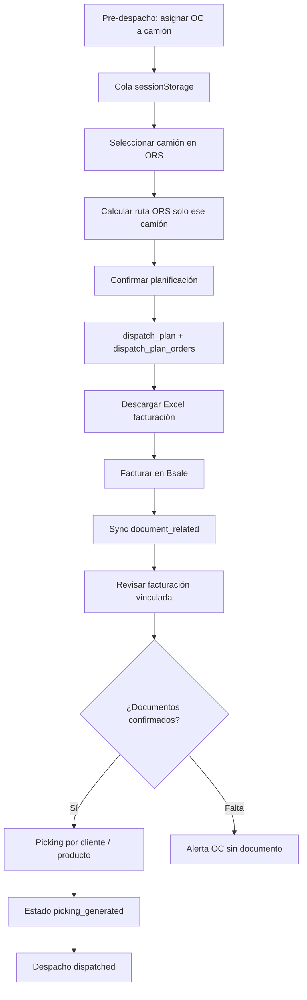

# FASE LOGÍSTICA 1.0 — Arquitectura planificación por camión

Documento de referencia del flujo operativo: planificar → confirmar → facturar → picking real → despacho.

---

## Objetivo

Convertir la planificación ORS en un **flujo por camión/ruta** con snapshot inmutable, Excel de facturación y picking basado en **documentos facturados reales** (boletas/facturas), no en órdenes de compra.

---

## Flujo completo

---

## Parte 1 — Planificación por camión (UI)

- **Lista lateral de camiones** (`OrsTruckSidebar`): Hyundai, Hino 2–5, etc.
- Al seleccionar un camión:
  - Mapa ORS **solo** paradas de ese camión
  - KPIs y costos **solo** esa ruta
  - Tripulación (chofer / peonetas) **solo** ese camión
- `POST /distribuidora/planificacion/ors-routes` envía **una sola ruta** por request (no mezcla camiones).

Archivos: `frontend/app/(dashboard)/distribuidora/planificacion/page.tsx`, `OrsTruckSidebar.tsx`.

---

## Parte 2 — Snapshot operacional (BD)

### Tabla `distribuidora.dispatch_plan`

| Campo | Descripción |
|-------|-------------|
| `id` | PK |
| `plan_session_id` | Enlace con cola pre-despacho (sessionStorage) |
| `planning_date` | Fecha operativa |
| `truck_id` | FK `trucks` |
| `route_name` | Etiqueta ruta / camión |
| `status` | Ver estados abajo |
| `driver_count`, `assistant_count` | Dotación por vuelta |
| `driver_cost_clp`, `assistant_cost_clp` | Tarifas congeladas al confirmar |
| `diesel_price_per_liter` | Precio diesel usado |
| `km_total`, `duration_min`, `liters_estimated` | Métricas ORS |
| `fuel_cost_clp`, `ferry_cost_clp`, `toll_cost_clp`, `extras_cost_clp`, `crew_cost_clp` | Desglose costos |
| `total_route_cost_clp` | Total ruta |
| `route_geometry` | GeoJSON ORS (referencia) |
| `confirmed_at` | Momento de confirmación |

Migración: `backend/sql/distribuidora/021_dispatch_plan.sql`.

### Tabla `distribuidora.dispatch_plan_orders`

Snapshot de cada OC incluida en el plan:

| Campo | Descripción |
|-------|-------------|
| `dispatch_plan_id` | FK plan |
| `oc_document_id` | ID documento OC (tipo 33) |
| `oc_number` | Número OC |
| `route_order` | Orden de visita ORS |
| `client_id`, `client_name`, `address`, `city` | Cliente congelado |
| `seller_name`, `payment_method`, `document_type_to_generate` | Desde `v_orders_purchase` al confirmar |
| `oc_total_amount`, `lat`, `lng` | Totales y georef |

**Regla crítica:** tras `confirmed_at`, el snapshot **no se recalcula** automáticamente.

---

## Parte 3 — Excel facturación

- **Endpoint:** `GET /distribuidora/dispatch-plans/{id}/billing-export`
- **Origen de datos:** solo `dispatch_plan_orders` (no OC en vivo).
- **Columnas:** orden ruta, número orden, forma pago, tipo documento a generar, cliente, total, vendedor, ciudad, dirección, camión, tripulación.
- **Nombre archivo:** `facturacion_{camion}_{YYYYMMDD}.xlsx`
- **Frontend:** botón “Excel facturación” en `OrsDispatchWorkflow`.

Servicio: `dispatch_plan_service.build_billing_excel_bytes`.

---

## Parte 4 — Enlace post facturación

### Vista `distribuidora.v_dispatch_plan_invoiced_documents`

Por cada OC del plan:

| Campo | Descripción |
|-------|-------------|
| `status` | `confirmed` \| `probable` \| `missing` |
| `relation_source` | `relateddetailid` \| `probable_match` |
| `related_document_id` | Boleta/factura confirmada (solo si `confirmed`) |
| `probable_*` | Candidato heurístico (no usado como confirmado) |

**Prioridad:**

1. `v_orders_purchase_status` + `document_related` → **confirmed**
2. `v_purchase_document_status_full` score ≥ 60 → **probable** (solo aviso)
3. Sin enlace → **missing**

**Endpoint:** `GET /distribuidora/dispatch-plans/{id}/invoiced-documents`

- Devuelve `warnings` con texto: *“OC aún sin documento facturado asociado”*
- `probable_notes` para matches no confirmados
- **No** trata probable como confirmado para picking

Migración vista: `022_dispatch_plan_invoiced_view.sql`.

---

## Parte 5 — Picking por cliente

- **Endpoint:** `GET /distribuidora/dispatch-plans/{id}/picking-by-client?validate=true`
- **Fuente:** `document_details` del `related_document_id` **solo si** `status = confirmed`
- **Orden:** `route_order` del snapshot
- **Por parada:** cliente, dirección, teléfono, número/tipo documento real, forma pago, vendedor, total documento
- **Líneas:** producto, variante, código barras, unidades, cajas (`products_master.units_per_box`), monto línea

**NO** usa líneas de la OC.

---

## Parte 6 — Picking por producto

- **Endpoint:** `GET /distribuidora/dispatch-plans/{id}/picking-by-product?validate=true`
- Consolidado por camión: agrupa detalles de boletas/facturas confirmadas
- Agrupación: tipo producto, producto, variante, código barras
- Totales: unidades, cajas, monto

**NO** usa OC.

---

## Parte 7 — Estados `dispatch_plan.status`

| Estado | Significado |
|--------|-------------|
| `draft` | Reservado (confirmación crea directo en `planned`) |
| `planned` | Camión confirmado; Excel disponible |
| `invoicing` | Esperando facturación / sync Bsale |
| `ready_for_picking` | Transición manual o futura automática |
| `picking_generated` | Picking cliente/producto generado |
| `dispatched` | Camión salió |

API: `PATCH /distribuidora/dispatch-plans/{id}/status`, `POST .../picking-generated`.

---

## Parte 8 — Frontend ORS

En **Planif. mapa ORS**:

1. Lista de camiones/rutas (sidebar)
2. Mapa + costos + tripulación del camión activo
3. **Confirmar planificación** → snapshot BD
4. Tras confirmar: Excel, revisar facturación, picking cliente, picking producto

Componentes: `OrsTruckSidebar`, `OrsDispatchWorkflow`, panel costos `OrsClientPanel` con `activeCamion`.

---

## Parte 9 — Validación antes de picking

Si `validate=true` (default):

- Requiere al menos un documento **confirmed**
- Si hay OCs `missing` → error 400 con mensaje claro
- Probables **no** habilitan picking automático; se muestran en revisión de facturación

---

## API resumen

| Método | Ruta |
|--------|------|
| GET | `/distribuidora/dispatch-plans/by-session/{plan_session_id}` |
| GET | `/distribuidora/dispatch-plans/{id}` |
| POST | `/distribuidora/dispatch-plans/confirm` |
| PATCH | `/distribuidora/dispatch-plans/{id}/status` |
| GET | `/distribuidora/dispatch-plans/{id}/invoiced-documents` |
| GET | `/distribuidora/dispatch-plans/{id}/billing-export` |
| GET | `/distribuidora/dispatch-plans/{id}/picking-by-client` |
| GET | `/distribuidora/dispatch-plans/{id}/picking-by-product` |
| POST | `/distribuidora/dispatch-plans/{id}/picking-generated` |

Router: `backend/routers/distribuidora_dispatch_plan.py`  
Servicio: `backend/services/distribuidora/dispatch_plan_service.py`

---

## Por qué picking NO usa OC

Al facturar en Bsale el detalle puede cambiar:

- Sustitución por stock
- Rebajas
- Productos eliminados o cantidades distintas

La OC refleja el **pedido original**; la boleta/factura refleja lo **realmente despachado/facturado**. Por eso:

- Excel de facturación → snapshot OC (qué se mandó a facturar)
- Picking → `document_details` de boleta/factura vía `document_related` confirmado

Los **probable matches** son ayuda operativa; no sustituyen `relateddetailid` hasta que Bsale/sync confirme el vínculo.

---

## Qué NO hace esta fase

- No modifica `document_related` manualmente
- No asume probable match como confirmado
- No recalcula snapshot tras confirmar
- No mezcla camiones en mapa/costos ORS
- No reemplaza `route_planning` legacy del día (`/distribuidora/planning`); conviven hasta migración completa

---

## Migraciones requeridas

Ejecutar schema Distribuidora hasta incluir:

- `021_dispatch_plan.sql`
- `022_dispatch_plan_invoiced_view.sql`

(vía `sync_repo.ensure_distribuidora_schema` o job de migraciones habitual).

---

## Próximos pasos sugeridos

- UI modal para visualizar/exportar picking cliente y producto (hoy API + mensaje en panel)
- Transición automática `planned` → `invoicing` → `ready_for_picking` tras sync
- Pantalla dedicada de revisión de facturación con tabla y filtros
- Enlace `dispatch_plan.id` con `route_planning` si se unifica el flujo del día
