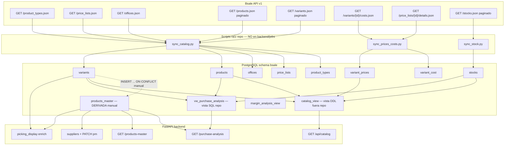

# Auditoría — Flujo de productos Bsale

**Fecha:** 2026-06-02  
**Alcance:** diagnóstico en repo + modelo PostgreSQL documentado. **Sin cambios de código.**  
**Hipótesis del incidente:** `bsale.products_master` desactualizado (última actualización ~abril) mientras el catálogo web muestra productos nuevos.

---

## Resumen ejecutivo

| Pregunta | Respuesta |
|----------|-----------|
| ¿Fuente de verdad hoy? | **Bsale API** → tablas **`bsale.products` + `bsale.variants`** (si corre `sync_catalog.py`). |
| ¿`products_master` reemplazó a variants? | **No.** Es una **tabla derivada** por barcode; no se alimenta sola. |
| ¿Por qué el catálogo web se ve al día? | Lee **`bsale.catalog_view`** (vista PG), armada sobre **variants + precios + stock**, no sobre `products_master`. |
| ¿Por qué compras/suppliers fallan en “productos nuevos”? | Mezcla: análisis desde **`vw_purchase_analysis`** (variants), pero **proveedor y ofertas** exigen fila en **`products_master`**. |
| ¿Job roto? | **`sync_catalog.py` no está en `backend/jobs/` ni en `SCRIPTS_REGISTRY`** → probable **no programado en Coolify**. |
| ¿Refresh de `products_master`? | Solo el SQL en `backend/sql/products_master_schema.sql` — **no hay job ni hook post-sync en el repo**. |

---

## A. Diagrama del flujo completo



### Cadena documentada en código

```
Bsale
  → sync_catalog.py
      → bsale.taxes, product_types, price_lists, offices, products, variants
  → sync_prices_costs.py
      → bsale.variant_cost, bsale.variant_prices
  → sync_stock.py
      → bsale.stocks

variants (+ products, types, prices, stock)
  → catalog_view (definición NO versionada en repo)
  → vw_purchase_analysis (purchase_intelligence_module.sql)

variants (barcode)
  → products_master SOLO si ejecutas products_master_schema.sql (UPSERT)
```

---

## 1. Procesos que sincronizan productos desde Bsale

| Script | Ubicación | ¿En Coolify registry? | Tablas producto |
|--------|-----------|------------------------|-----------------|
| **`sync_catalog.py`** | Raíz del repo | **No** (`SCRIPTS_REGISTRY` solo lista `backend/jobs/*`) | `products`, `variants`, `product_types`, `price_lists`, `offices`, `taxes` |
| **`sync_prices_costs.py`** | Raíz | **No** | `variant_cost`, `variant_prices` |
| **`sync_stock.py`** | Raíz | **No** | `stocks` |
| **`sync_meta_bs.py`** | Raíz | **No** | Metadatos (`document_types`, `bsale_users`) — no catálogo |
| **`backend/jobs/sync_bsale_distribuidora.py`** | `backend/jobs` | **Sí** | **Documentos OC/ventas**, no catálogo de productos |

**Conclusión:** el catálogo Bsale depende de scripts **huérfanos en la raíz**. Si Coolify solo ejecuta jobs bajo `backend/jobs/`, **el sync de productos puede estar detenido desde abril** aunque Distribuidora siga sincronizando documentos.

---

## 2. Endpoints Bsale utilizados (evidencia en código)

Base: `https://api.bsale.io/v1` (`sync_catalog.py`, `sync_prices_costs.py`, `sync_stock.py`).

| Recurso | Método / ruta | Script |
|---------|---------------|--------|
| Tipos de producto | `GET /product_types.json` | `sync_catalog.py` |
| Listas de precio | `GET /price_lists.json` | `sync_catalog.py` |
| Sucursales | `GET /offices.json` | `sync_catalog.py` |
| Impuestos | `GET /taxes.json` | `sync_catalog.py` |
| **Productos** | `GET /products.json?limit=&offset=` | `sync_catalog.py` |
| **Variantes** | `GET /variants.json?limit=&offset=` | `sync_catalog.py` |
| Costo variante | `GET /variants/{id}/costs.json` | `sync_prices_costs.py` |
| Detalle lista precios | `GET /price_lists/{id}/details.json` | `sync_prices_costs.py` |
| Stock | `GET /stocks.json` | `sync_stock.py` |

Paginación típica: `limit=50`. Tokens: `bsale.companies.bsale_token` → variable de entorno por empresa.

---

## 3. Tablas actualizadas durante el sync

### `sync_catalog.py` (UPSERT)

- `bsale.taxes`
- `bsale.product_types`
- `bsale.price_lists`
- `bsale.offices`
- **`bsale.products`** — `company_id`, `bsale_id`, `name`, `product_type_id`, impuestos JSON, `tax_factor`
- **`bsale.variants`** — `company_id`, `bsale_id`, `product_id`, `code`, `bar_code`, `description`

**No escribe** en `bsale.products_master`.

### Post-procesos SQL (manuales / migraciones)

| Artefacto | Qué hace |
|-----------|----------|
| `backend/sql/products_master_schema.sql` | `INSERT ... SELECT FROM variants` → **`products_master`** |
| `backend/sql/purchase_intelligence_module.sql` | `units_per_box` en variants + vistas de compras |
| `backend/sql/stocks_add_updated_at.sql` | columna `updated_at` en stocks (marca de sync stock) |

---

## 4. Qué tabla usa cada módulo

| Módulo | Consumidor | Fuente principal | `products_master` |
|--------|------------|------------------|-------------------|
| **Catálogo web** | `GET /api/catalog` → `bsale.catalog_view` | **variants + prices + stock** (vista) | No |
| **Compras / análisis** | `GET /purchase-analysis` → `vw_purchase_analysis` | **variants + products + stocks** | Solo si filtras por `supplier_id` (INNER JOIN) |
| **Suppliers** | `bsale.suppliers` + `PATCH /products-master/{barcode}` | Edición **`supplier_id` en PM** | **Sí** (asignación proveedor) |
| **Ofertas / uploads** | `offers.py`, `uploads.py` | Validación barcode en **PM** | **Sí** |
| **Promociones** | `promotions.py` grilla | **LEFT JOIN PM** + respaldo `variants` | Parcial |
| **Pickings** | `picking_display.py` enriquecimiento lectura | Snapshot + **PM/variants** lookup | Enriquecimiento nombres/cajas |
| **ERP products** | `GET /products-without-cost` | `product_margins` | No |

**Fuente operativa “viva” para catálogo y compras:** `bsale.variants` + `bsale.products` (si el sync corre).  
**Fuente operativa “congelada” para proveedor/comercial:** `bsale.products_master` (si no refrescas el UPSERT).

---

## 5. Última ejecución exitosa del sync de productos

En el repo **no existe**:

- fila en `distribuidora.sync_state` para catálogo (solo sync documental Distribuidora),
- tabla `sync_log` para `sync_catalog`,
- timestamp en `bsale.products` / `bsale.variants` (sin `updated_at` en esquema base del sync).

### Indicadores indirectos en PostgreSQL (ejecutar en prod)

```sql
-- Antigüedad products_master (sí tiene updated_at)
SELECT
    COUNT(*) AS filas,
    MIN(updated_at) AS min_upd,
    MAX(updated_at) AS max_upd
FROM bsale.products_master;

-- Stock: si aplicaron stocks_add_updated_at.sql
SELECT MAX(updated_at) AS ultimo_sync_stock
FROM bsale.stocks;

-- Costos: last_update en variant_cost
SELECT MAX(last_update) AS ultimo_sync_costos
FROM bsale.variant_cost;
```

**Recomendación operativa:** revisar logs de Coolify / cron del servidor donde antes corría `python sync_catalog.py` (o equivalente). No hay evidencia en git de schedule activo.

---

## 6. Jobs rotos o deshabilitados

| Observación | Riesgo |
|-------------|--------|
| `sync_catalog.py` fuera de `backend/jobs/` | No aparece en gobernanza FASE 4 → **fácil de olvidar en deploy** |
| Sin encadenamiento `sync_catalog` → refresh `products_master` | PM queda en fecha del último SQL manual |
| `SCRIPTS_REGISTRY` no menciona sync raíz | Equipo asume que “el ERP sincroniza todo” con job Distribuidora |
| Catálogo y compras **no dependen de PM** | Máscara el problema hasta que abres suppliers / Excel proveedor |

No se encontró flag “deshabilitado” en código; el problema es **ausencia de automatización documentada**, no un `if False`.

---

## 7. ¿`products_master` fue reemplazada?

**No.** Sigue siendo la tabla de:

- proveedor (`supplier_id`),
- validación de barcodes en ofertas/cargas masivas,
- consolidación comercial por barcode (`companies` JSONB).

Lo que **sí** la reemplazó de facto para **listado público** es la cadena **`variants` → `catalog_view`**.

Para **compras inteligentes**, la vista canónica es **`vw_purchase_analysis`** (derivada de variants), no PM.

---

## B. Cantidad de productos por tabla (plantilla)

Ejecutar en PostgreSQL (ajustar `company_id`; Quillotana suele ser `3`):

```sql
-- B.1 Conteos globales
SELECT 'products' AS tabla, COUNT(*) AS n FROM bsale.products
UNION ALL
SELECT 'variants', COUNT(*) FROM bsale.variants
UNION ALL
SELECT 'products_master', COUNT(*) FROM bsale.products_master
UNION ALL
SELECT 'variants_con_barcode', COUNT(*) FROM bsale.variants
  WHERE NULLIF(BTRIM(bar_code), '') IS NOT NULL
UNION ALL
SELECT 'catalog_view', COUNT(*) FROM bsale.catalog_view;

-- B.2 Por empresa
SELECT
    3 AS company_id,
    (SELECT COUNT(*) FROM bsale.products WHERE company_id = 3) AS products,
    (SELECT COUNT(*) FROM bsale.variants WHERE company_id = 3) AS variants,
    (SELECT COUNT(*) FROM bsale.variants WHERE company_id = 3
       AND NULLIF(BTRIM(bar_code), '') IS NOT NULL) AS variants_barcode;

-- B.3 Frescura products_master
SELECT
    DATE_TRUNC('month', updated_at) AS mes,
    COUNT(*) AS filas
FROM bsale.products_master
GROUP BY 1
ORDER BY 1 DESC;
```

### Conteo en Bsale API (fuera de SQL)

No hay script en repo que compare contra API. Manualmente, por empresa:

```http
GET https://api.bsale.io/v1/products.json?limit=1
GET https://api.bsale.io/v1/variants.json?limit=1
```

Usar campo `count` de la respuesta Bsale y comparar con conteos SQL de B.1.

---

## C. Queries — productos faltantes

### C.1 Variantes en Bsale (PG) que no están en `products_master`

```sql
SELECT
    v.company_id,
    v.bsale_id AS variant_id,
    v.bar_code AS barcode,
    p.name AS product_name,
    v.description AS variant_name
FROM bsale.variants v
INNER JOIN bsale.products p
    ON p.company_id = v.company_id AND p.bsale_id = v.product_id
WHERE v.company_id = 3
  AND NULLIF(BTRIM(v.bar_code), '') IS NOT NULL
  AND NOT EXISTS (
      SELECT 1
      FROM bsale.products_master pm
      WHERE pm.barcode = BTRIM(v.bar_code)
  )
ORDER BY v.bsale_id DESC
LIMIT 200;
```

### C.2 En `products_master` pero sin variante activa (obsoletos / barcode cambiado)

```sql
SELECT
    pm.barcode,
    pm.product_name,
    pm.variant_name,
    pm.updated_at
FROM bsale.products_master pm
WHERE NOT EXISTS (
    SELECT 1
    FROM bsale.variants v
    WHERE v.company_id = 3
      AND BTRIM(v.bar_code) = pm.barcode
);
```

### C.3 En catálogo web pero sin `products_master` (explica UX “catálogo OK, compras no”)

```sql
SELECT
    cv.variant_id,
    cv.barcode,
    cv.product,
    cv.variant
FROM bsale.catalog_view cv
WHERE NULLIF(BTRIM(cv.barcode), '') IS NOT NULL
  AND NOT EXISTS (
      SELECT 1 FROM bsale.products_master pm WHERE pm.barcode = BTRIM(cv.barcode)
  )
ORDER BY cv.product
LIMIT 200;
```

### C.4 Compras: en `vw_purchase_analysis` sin proveedor en PM

```sql
SELECT
    pa.variant_id,
    pa.barcode,
    pa.product_name,
    pa.variant_name,
    pa.status
FROM bsale.vw_purchase_analysis pa
WHERE pa.company_id = 3
  AND pa.barcode IS NOT NULL
  AND NOT EXISTS (
      SELECT 1 FROM bsale.products_master pm
      WHERE pm.barcode = pa.barcode AND pm.supplier_id IS NOT NULL
  )
ORDER BY pa.costo_total_compra DESC NULLS LAST
LIMIT 100;
```

### C.5 Divergencia de nombre (PM abril vs producto actual en variants)

```sql
SELECT
    pm.barcode,
    pm.product_name AS pm_producto,
    pm.variant_name AS pm_variante,
    pm.updated_at,
    p.name AS actual_producto,
    v.description AS actual_variante
FROM bsale.products_master pm
JOIN bsale.variants v
  ON v.company_id = 3 AND BTRIM(v.bar_code) = pm.barcode
JOIN bsale.products p
  ON p.company_id = v.company_id AND p.bsale_id = v.product_id
WHERE pm.product_name IS DISTINCT FROM p.name
   OR pm.variant_name IS DISTINCT FROM v.description
ORDER BY pm.updated_at ASC
LIMIT 100;
```

---

## D. Propuesta de arquitectura definitiva (sin implementar aún)

### Principio

Una sola **fuente de verdad operativa en PostgreSQL**:

> **`bsale.variants` + `bsale.products`** (alimentadas por job único de catálogo Bsale).

Todo lo demás es **vista o caché** con SLA claro.

### Capas recomendadas

| Capa | Nombre | Rol |
|------|--------|------|
| 1 | Bsale API | Verdad externa |
| 2 | `bsale.products`, `bsale.variants`, `variant_prices`, `stocks`, `variant_cost` | Réplica sincronizada (job programado) |
| 3 | **`bsale.v_product_catalog`** (nueva vista, versionada en repo) | Reemplaza ambigüedad `catalog_view` + documentación |
| 4 | **`bsale.products_master`** → renombrar mentalmente a **`product_commercial_cache`** | Solo: `supplier_id`, flags ERP, `companies`; refresh **automático post-sync** |
| 5 | Vistas analíticas existentes | `vw_purchase_analysis`, `margin_analysis_view` — siguen en capa 2 |

### Job único propuesto (futuro)

```
Coolify: bsale_catalog_sync (diario o cada N horas)
  1. python sync_catalog.py      # o mover a backend/jobs/sync_bsale_catalog.py
  2. python sync_prices_costs.py
  3. python sync_stock.py
  4. psql -f refresh_products_master.sql   # UPSERT de products_master_schema.sql
  5. opcional: REFRESH MATERIALIZED VIEW si se crea v_product_catalog materializada
```

### Reglas por módulo (objetivo)

| Módulo | Debe leer |
|--------|-----------|
| Catálogo web | Vista capa 3 (basada en variants, no PM) |
| Compras | `vw_purchase_analysis`; proveedor: **LEFT JOIN** cache comercial, no INNER obligatorio |
| Suppliers | Escribe solo `supplier_id` en cache; nunca “crea producto” sin variant |
| Pickings | `products` + `variants` (ya enriquecido en lectura); PM opcional |

### Métricas de salud (dashboard SQL)

- `count(variants)` vs `count(products_master)`
- `max(products_master.updated_at)` vs `now() - interval '24 hours'`
- filas C.1 > 0 → alerta

---

## Checklist de diagnóstico inmediato (operaciones)

1. Ejecutar sección **B** y **C.1** en producción.
2. Confirmar en Coolify si existe job para `sync_catalog.py` (ruta absoluta en servidor).
3. Si variants está al día y PM no → ejecutar **solo** el bloque `INSERT ... ON CONFLICT` de `products_master_schema.sql` (ventana de mantenimiento).
4. Inventariar definición de **`bsale.catalog_view`** en pgAdmin (`\d+ bsale.catalog_view` / `pg_get_viewdef`) y **versionarla** en el repo.
5. Comparar `count` API Bsale vs SQL B.1.

---

## Referencias en repo

| Archivo | Rol |
|---------|-----|
| `sync_catalog.py` | Sync products + variants |
| `sync_prices_costs.py` | Precios y costos |
| `sync_stock.py` | Stock |
| `backend/sql/products_master_schema.sql` | UPSERT PM desde variants |
| `backend/sql/purchase_intelligence_module.sql` | `vw_purchase_analysis` |
| `backend/routers/catalog.py` | API catálogo → `catalog_view` |
| `backend/routers/purchases.py` | Compras + join PM por proveedor |
| `backend/routers/products_master.py` | CRUD lectura/patch PM |
| `backend/SCRIPTS_REGISTRY.md` | Jobs Coolify (sin sync catálogo) |

---

*Documento de auditoría — no modifica código ni ejecuta sync.*
