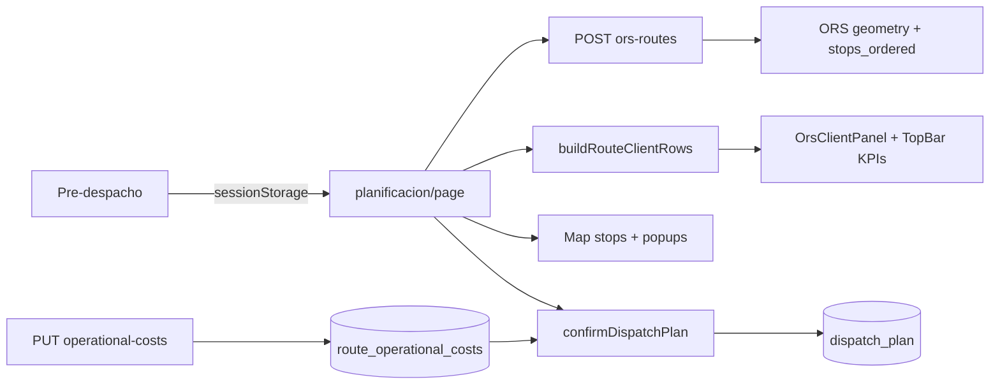

# ORS Operacional 2.0 — Centro de Planificación y Despacho

**Proyecto:** Quillotana ERP (`bsale-api-tools`)  
**Ruta:** Distribuidora → Planif. mapa ORS (`/distribuidora/planificacion`)  
**Estado:** Diseño aprobado pendiente — sin implementación rentabilidad  
**Versión:** 1.0 — Mayo 2026

**Alcance:** Mejorar decisiones operacionales **antes** del despacho.  
**Fuera de alcance:** Márgenes reales, utilidad, rentabilidad logística (solo preparación técnica).

---

## 1. Resumen ejecutivo

### Problema

El módulo actual es un **visor de rutas ORS** con KPIs de distancia, combustible y personal. Falta visibilidad comercial y operativa integrada en una sola pantalla:

- ¿Cuánto vende la ruta?
- ¿Cuánto costará operarla (ferry, viáticos, otros)?
- ¿Qué clientes son de bajo valor o están aislados?
- ¿La secuencia ORS tiene sentido en el mapa?

### Objetivo ORS 2.0

Convertir `/distribuidora/planificacion` en un **Centro Operacional de Planificación y Despacho** donde el usuario responda, sin salir de la pantalla:

| Pregunta | Dónde |
|----------|--------|
| ¿Qué clientes lleva cada camión? | Panel lateral + mapa |
| ¿Cuánto vende la ruta? | KPI Venta Ruta |
| ¿Cuánto costará operarla? | KPI Costo Operacional |
| ¿Qué clientes son de bajo valor? | Semáforo 🟢🟡🔴 |
| ¿Qué clientes están aislados? | Indicador ⚫ |
| ¿La secuencia ORS es coherente? | Mapa con nº + comuna |

### Lo que NO cambia

- Motor ORS (`POST /distribuidora/planificacion/ors-routes`)
- Flujo Pre-despacho → sessionStorage → planificación
- Confirmación plan (`confirmDispatchPlan`) y workflow facturación/picking
- Cálculo de márgenes en `DispatchPlanInvoicingDashboard` (post-factura)

---

## 2. Estado actual (referencia código)

| Área | Ubicación | Qué hace hoy |
|------|-----------|--------------|
| Página principal | `frontend/app/(dashboard)/distribuidora/planificacion/page.tsx` | ORS por camión, confirmar plan |
| KPIs superiores | `OrsTopBar.tsx` | Km, clientes, tiempo, litros, combustible, personal, total |
| Diesel | `OrsFuelConfigBar.tsx` | Precio diesel global (default ~1200) |
| Panel lateral | `OrsClientPanel.tsx` | Lista por **OC/parada**, no por cliente agregado |
| Mapa | `planificacion-despacho-map-client.tsx` | Polyline ORS, marcador numerado, tooltip básico |
| Camiones | `OrsTruckSidebar.tsx` | Lista camiones, paradas, estado plan |
| Costos backend | `logistics_cost_service.py` | Combustible, ferry (settings), crew |
| Persistencia plan | `dispatch_plan` + `dispatch_plan_orders` | `ferry_cost_clp`, `extras_cost_clp`, `oc_total_amount` |
| Visitas UI | `ors-map-ui.ts` | `buildOrsVisitRows` — una fila por OC |

### Gaps respecto al objetivo

| Requerimiento | Estado |
|---------------|--------|
| KPI Venta Ruta | No visible (datos en `total_amount` por OC) |
| Ferry / Viáticos / Otros editables por ruta | Ferry en settings/backend; no UI por planificación |
| Costo Operacional (sin margen) | Mezclado con personal en “Costo total ruta” |
| Listado clientes con semáforo | Lista es por parada OC |
| Click cliente → centrar mapa + popup | Parcial: `selectedVisitId` + highlight |
| Popup rico (obs, día entrega) | Solo tooltip nombre + camión |
| Cliente aislado | No implementado |
| KPI comercial (conteos semáforo) | No |
| Capacidad kg utilizada | No en sidebar |
| Mapa: comuna en marcador | No (`label` = nombre cliente) |

---

## 3. Arquitectura de pantalla (layout)

```
┌─────────────────────────────────────────────────────────────────────────────┐
│ SECCIÓN A — KPIs operacionales (OrsTopBar 2.0)                              │
│ Km | Clientes | Tiempo | Litros | Combustible | Venta Ruta | Costo Operac. │
│      🟢8 🟡11 🔴4 ⚫1  (KPI comercial compacto)                              │
├──────────┬──────────────────────────────────────────────────┬───────────────┤
│ Camiones │                                                  │ CLIENTES DE   │
│ (sidebar)│              MAPA ORS                            │ LA RUTA       │
│ + capac. │         paradas numeradas + comuna               │ semáforo      │
│          │                                                  │ orden ORS     │
├──────────┴──────────────────────────────────────────────────┴───────────────┤
│ SECCIÓN B — Costos operacionales editables (por camión / plan_session)      │
│ Diesel | Ferry | Viáticos | Otros | Σ Costo operacional                      │
├─────────────────────────────────────────────────────────────────────────────┤
│ Workflow: Confirmar plan · Facturación · Picking (existente)                │
└─────────────────────────────────────────────────────────────────────────────┘
```

**Principio:** Una sola vista; sin modales obligatorios para decidir.

---

## 4. Sección A — KPIs superiores

### 4.1 Mantener (sin cambio de fuente)

| KPI | Fuente |
|-----|--------|
| Km total | `orsRoutes[].distance_km` |
| Clientes | `Set(client_id)` en órdenes del camión activo |
| Tiempo total | `orsRoutes[].duration_min` |
| Litros estimados | `orsRoutes[].liters_estimated` |
| Costo combustible | `orsRoutes[].fuel_cost_clp` |

### 4.2 Agregar

| KPI | Cálculo | Siempre visible |
|-----|---------|-----------------|
| **Venta Ruta** | `SUM(oc_total_amount)` órdenes del camión activo | Sí |
| **Ferry** | `route_operational_costs.ferry_clp` | Sí (monto) |
| **Viáticos** | `route_operational_costs.per_diem_clp` | Sí |
| **Otros gastos** | `route_operational_costs.other_clp` | Sí |
| **Costo Operacional** | Ver fórmula §5 | Sí |

### 4.3 Fórmula Costo Operacional (v2.0)

```
costo_operacional =
    fuel_cost_clp
  + ferry_clp
  + viaticos_clp
  + otros_clp
```

**No incluir:** personal/crew, peajes (fase posterior opcional), márgenes, utilidad.

**Nota:** El KPI “Personal” actual en `OrsTopBar` se mantiene como métrica **informativa separada**, no dentro de Costo Operacional.

### 4.4 KPI comercial compacto (en barra superior)

```
🟢 8   🟡 11   🔴 4   ⚫ 1
```

Conteos de **clientes únicos** en la ruta activa (ver §8–9).

---

## 5. Sección B — Costos operacionales editables

### 5.1 Panel `OrsOperationalCostsPanel` (nuevo)

Ubicación: debajo de KPIs o integrado en `OrsClientPanel` (pestaña “Costos”).

| Campo | Tipo | Default | Persistencia |
|-------|------|---------|--------------|
| Precio diesel CLP/L | número | **1500** (cambiar default UI de 1200) | `system_config` / fuel-config existente |
| Ferry | monto CLP | 0 | Por `plan_session_id` + `truck_id` |
| Viáticos | monto CLP | 0 | Idem |
| Otros gastos | monto CLP | 0 | Idem |

**Ejemplo visual:**

```
Combustible:     $135.000  (calculado)
Ferry:           $ 18.000  [editable]
Viáticos:        $ 25.000  [editable]
Otros:           $ 10.000  [editable]
─────────────────────────────
Costo operacional: $188.000
```

### 5.2 Modelo de datos

**Opción recomendada:** tabla nueva ligera (no romper `dispatch_plan` hasta confirmar).

```sql
-- backend/sql/distribuidora/032_route_operational_costs.sql
CREATE TABLE IF NOT EXISTS distribuidora.route_operational_costs (
    id              BIGSERIAL PRIMARY KEY,
    plan_session_id TEXT NOT NULL,
    truck_id        INTEGER NOT NULL REFERENCES distribuidora.trucks (id),
    ferry_clp       INTEGER NOT NULL DEFAULT 0,
    per_diem_clp    INTEGER NOT NULL DEFAULT 0,  -- viáticos
    other_clp       INTEGER NOT NULL DEFAULT 0,
    diesel_clp_per_liter NUMERIC(12,2),  -- override sesión opcional
    updated_at      TIMESTAMPTZ NOT NULL DEFAULT NOW(),
    CONSTRAINT uq_route_operational_costs_session_truck
        UNIQUE (plan_session_id, truck_id)
);
```

**Al confirmar plan:** copiar a `dispatch_plan.ferry_cost_clp`, `extras_cost_clp` (viáticos+otros o columnas nuevas).

**API:**

| Método | Ruta | Descripción |
|--------|------|-------------|
| GET | `/distribuidora/planificacion/operational-costs?plan_session_id=&truck_id=` | Leer |
| PUT | `/distribuidora/planificacion/operational-costs` | Guardar (autosave debounced) |

---

## 6. KPI Venta Ruta

### Cálculo

```typescript
function computeRouteSales(orders: PlanificacionStoredOrder[]): number {
  return orders.reduce((s, o) => s + Number(o.total_amount ?? 0), 0)
}
```

- Ámbito: **camión seleccionado** (`selectedCamion`).
- Incluir órdenes con y sin georef (venta es comercial, no logística).
- Mostrar siempre en `OrsTopBar`, incluso mientras `loading` (skeleton → valor).

### Agregación por cliente (para panel y semáforo)

```typescript
type RouteClientRow = {
  client_id: number
  nombre: string
  comuna: string | null
  venta_total: number
  oc_count: number
  stop_index_min: number      // primera parada ORS del cliente
  semaphore: 'green' | 'yellow' | 'red'
  isolated: boolean
  observaciones: string[]     // merge OC
  dia_entrega_label: string | null
}
```

Agrupar múltiples OC del mismo `client_id` en una fila del panel.

---

## 7. Panel «Clientes de la ruta»

### 7.1 Reemplazar / extender `OrsClientPanel`

Nueva sección superior del panel lateral:

```
CLIENTES DE LA RUTA
───────────────────
1. Comercial Sur        🟢  $485.000
2. Minimarket Ana       🟡  $165.000
3. Don Pepe             🔴   $78.000
4. Comercial Castro     🟢  $330.000
```

- Orden: **mismo que ORS** (`stop_index_min` ascendente).
- Número de lista = orden de visita del cliente en ruta.
- Semáforo según `venta_total` del cliente (no por OC).

### 7.2 Interacción click → mapa

Flujo:

1. Usuario hace click en fila cliente.
2. `setSelectedClientId(clientId)`.
3. Mapa:
   - `map.flyTo([lat, lng], 15, { duration: 0.5 })`
   - Abrir `Popup` Leaflet en marcador de la **primera parada** del cliente.
   - `highlightedStopKey` = parada principal.

**Componente mapa:** extender `PlanificacionDespachoMapClient` con:

```typescript
type Props = {
  ...
  flyToTarget?: { lat: number; lng: number } | null
  openPopupStopKey?: string | null
  onPopupClose?: () => void
}
```

Usar `useMap()` en subcomponente `MapFlyToController` (patrón existente en rutero).

---

## 8. Popup del cliente (marcador)

### Contenido

| Campo | Fuente |
|-------|--------|
| Cliente | `nombre_fantasia` |
| Dirección | `dispatch_plan_orders.address` / enriquecer desde OC |
| Comuna | `municipality` |
| Venta total | Σ `total_amount` |
| Cantidad OC | count documentos |
| Observaciones | `observaciones` OC (join API) |
| Día entrega | `dia_entrega_label` (reutilizar `delivery_day_detect.py`) |

**Ejemplo:**

```
MINIMERCADO ANA
───────────────
Venta:      $165.000
OC:         3
Comuna:     Chonchi
Día:        Viernes
Observación: Dejar en bodega.
```

### Implementación

- Sustituir `Tooltip` por `Popup` en click del marcador (tooltip en hover opcional).
- Componente: `OrsStopPopup.tsx`.
- Enriquecer órdenes al cargar planificación: `GET /distribuidora/planificacion/orders/enriched?document_ids=...` (nuevo) o ampliar payload sessionStorage desde pre-despacho.

**Datos faltantes en `PlanificacionStoredOrder`:** agregar opcionales:

```typescript
municipality?: string | null
observaciones?: string | null
dia_entrega_label?: string | null
direccion?: string | null
```

Pre-despacho al «Pasar a planificación» puede incluir estos campos sin romper compatibilidad.

---

## 9. Semáforo comercial

### Reglas

| Color | Condición (`venta_total` cliente) |
|-------|-----------------------------------|
| 🟢 Verde | ≥ $300.000 |
| 🟡 Amarillo | $100.000 – $299.999 |
| 🔴 Rojo | < $100.000 |

### Aplicación

| Superficie | Implementación |
|------------|----------------|
| Listado clientes | Emoji + borde/badge color |
| Marcador mapa | Anillo exterior `numberedIcon(color, semaphoreRing)` |
| Popup | Badge semáforo junto al nombre |

**Util:** `frontend/lib/ors-commercial-semaphore.ts`

```typescript
export type CommercialSemaphore = 'green' | 'yellow' | 'red'

export function commercialSemaphore(ventaClp: number): CommercialSemaphore {
  if (ventaClp >= 300_000) return 'green'
  if (ventaClp >= 100_000) return 'yellow'
  return 'red'
}
```

---

## 10. Cliente aislado

### Definición

```
isolated =
  venta_total < 50_000
  AND distancia_adicional_km > 10
```

`distancia_adicional_km` = distancia desde el **centroide** de las paradas del grupo principal (clientes con venta ≥ $50.000 o todos menos el aislado) hasta la parada del cliente, vía haversine o distancia por carretera aproximada (fase 1: haversine).

### UX

- Badge **⚫ Cliente aislado** en listado y popup.
- No bloquea despacho ni confirmación de plan.
- Contador en KPI comercial: `⚫ 1`.

**Util:** `detectIsolatedClients(stops, clientRows): Set<client_id>`

---

## 11. KPI comercial (detalle)

Mostrar en barra superior o bajo Venta Ruta:

| Indicador | Cálculo |
|-----------|---------|
| Clientes verdes | `count(semaphore === green)` |
| Clientes amarillos | `count(semaphore === yellow)` |
| Clientes rojos | `count(semaphore === red)` |
| Clientes aislados | `count(isolated)` |

---

## 12. Camiones — capacidad utilizada

### Extender `OrsTruckSidebar`

Datos de `distribuidora.trucks.max_weight_kg`.

**Peso asignado (fase 1 estimado):**

Opción A — si existe peso en OC: `SUM(weight_kg)`  
Opción B — **proxy operativo:** `stop_count * peso_promedio_config` (configurable)  
Opción C — usar `total_amount` solo como referencia comercial (no kg)

**Recomendación fase 1:** integrar `products_master.weight` o campo futuro; mientras tanto mostrar:

```
Capacidad:  5600 kg
Asignado:   — (pendiente peso real)
Paradas:    12
```

**Fase 1.5:** `assigned_kg` desde suma variantes en OC details (cache).

```
Utilización: 75%
⚠ Sobrecarga si assigned_kg > max_weight_kg
```

---

## 13. Mapa — parada + comuna

### Marcador actual

```typescript
numberedIcon(n, color, highlighted)
// label en tooltip = nombre cliente
```

### Marcador 2.0

```html
<div class="ors-marker">
  <span class="num">1</span>
  <span class="comuna">Castro</span>
</div>
```

- `PlanificacionMapStop` ampliar:

```typescript
export type PlanificacionMapStop = {
  lat: number
  lng: number
  num: number
  label: string
  comuna?: string
  client_id?: number
  semaphore?: CommercialSemaphore
  isolated?: boolean
}
```

- Tooltip corto: `1 · Castro`
- Popup completo al click (§8).

---

## 14. Preparación futura — Rentabilidad Logística

**NO IMPLEMENTAR.** Solo dejar hooks y comentarios.

### Vista futura (referencia)

```sql
-- FUTURO: distribuidora.v_route_profitability
-- venta_facturada_real, costo_operacional, margen_bruto, utilidad_neta
```

### KPIs futuros (comentario en código)

```typescript
// FUTURO_RENTABILIDAD_LOGISTICA:
// - venta_facturada_real (v_dispatch_plan_invoiced_documents)
// - margen_real (dispatch_commercial_margin_service)
// - utilidad_por_ruta, utilidad_por_cliente
// - venta_por_km, margen_por_km
// - comparativo_historico por planning_date + truck_id
```

### Punto de extensión

- `OrsTopBar`: slot `profitabilitySlot?: ReactNode` deshabilitado.
- `dispatch_plan.net_operational_clp` ya existe para fase posterior — no usar en ORS 2.0 UI.

---

## 15. Flujo de datos



---

## 16. Endpoints nuevos / cambios

| Método | Ruta | Fase |
|--------|------|------|
| GET/PUT | `/planificacion/operational-costs` | 1 |
| GET | `/planificacion/route-clients?plan_session_id&truck_id` | 1 (opcional; puede ser cliente) |
| PATCH | `PlanificacionStoredOrder` en pre-despacho payload | 1 |
| — | Enriquecer `confirmDispatchPlan` con `viaticos_clp` | 2 |

**Sin cambios:** `POST /planificacion/ors-routes`, ORS externo, picking, facturación.

---

## 17. Componentes frontend

```
frontend/components/distribuidora/planificacion/
├── OrsTopBar.tsx                    -- extender KPIs
├── OrsOperationalCostsPanel.tsx     -- nuevo
├── OrsClientPanel.tsx               -- vista por cliente + semáforo
├── OrsClientRouteList.tsx           -- nuevo (listado)
├── OrsStopPopup.tsx                 -- nuevo (mapa)
├── OrsCommercialKpiStrip.tsx        -- 🟢🟡🔴⚫
├── OrsTruckSidebar.tsx              -- capacidad / utilización
└── planificacion-despacho-map-client.tsx  -- popup, flyTo, comuna

frontend/lib/
├── ors-map-ui.ts                    -- buildRouteClientRows
├── ors-commercial-semaphore.ts      -- nuevo
└── ors-isolated-client.ts           -- nuevo
```

---

## 18. Plan de implementación

### Fase 1 — KPIs + venta + costos operacionales (1–2 sem)

| # | Tarea |
|---|-------|
| 1 | SQL `route_operational_costs` + API GET/PUT |
| 2 | `OrsOperationalCostsPanel` + default diesel 1500 |
| 3 | KPI Venta Ruta + Costo Operacional en `OrsTopBar` |
| 4 | Persistir costos al confirmar plan |
| 5 | Extender `PlanificacionStoredOrder` con comuna/obs/día |

### Fase 2 — Panel clientes + semáforo (1–2 sem)

| # | Tarea |
|---|-------|
| 1 | `buildRouteClientRows` agrupado por `client_id` |
| 2 | `OrsClientRouteList` con semáforo |
| 3 | `OrsCommercialKpiStrip` |
| 4 | Colores en marcadores |

### Fase 3 — Mapa interactivo (1 sem)

| # | Tarea |
|---|-------|
| 1 | Click cliente → flyTo + Popup |
| 2 | Marcador con comuna |
| 3 | `OrsStopPopup` contenido completo |

### Fase 4 — Aislados + capacidad camión (1 sem)

| # | Tarea |
|---|-------|
| 1 | `detectIsolatedClients` |
| 2 | Badge ⚫ |
| 3 | Capacidad kg en sidebar (peso real o proxy) |

### Fase 5 — Rentabilidad (futuro)

- Integrar `net_operational_clp`, márgenes reales, dashboard comparativo.

---

## 19. Criterios de aceptación

1. Con camión seleccionado, **Venta Ruta** muestra suma OC visible sin recargar.
2. Ferry / Viáticos / Otros editables persisten al cambiar de camión y al recargar sesión.
3. **Costo Operacional** = combustible + ferry + viáticos + otros (sin personal).
4. Panel lista clientes en orden ORS con semáforo correcto ($300k / $100k).
5. Click en cliente centra mapa y abre popup con venta, OC, comuna, día, obs.
6. Cliente &lt; $50k y &gt;10 km del grupo muestra ⚫ sin bloquear confirmar.
7. Marcadores muestran número + comuna.
8. Sidebar camión muestra capacidad y alerta sobrecarga cuando aplique.
9. Flujo ORS / facturación / picking **sin regresiones**.

---

## 20. Decisiones abiertas

1. **Peso asignado:** ¿proxy por paradas o integrar peso desde detalle OC en fase 1?
2. **Viáticos vs `per_diem` en `logistics_cost_settings`:** unificar nombre UI “Viáticos”.
3. **Peajes:** ¿incluir en “Otros” o KPI separado en v2.1?

---

## 21. Próximo paso

1. Validar diseño con operaciones / despacho.
2. Aprobar migración `032_route_operational_costs.sql`.
3. Implementar **Fase 1** sin tocar rentabilidad.

---

*Quillotana ERP — ORS Operacional 2.0 v1.0*
