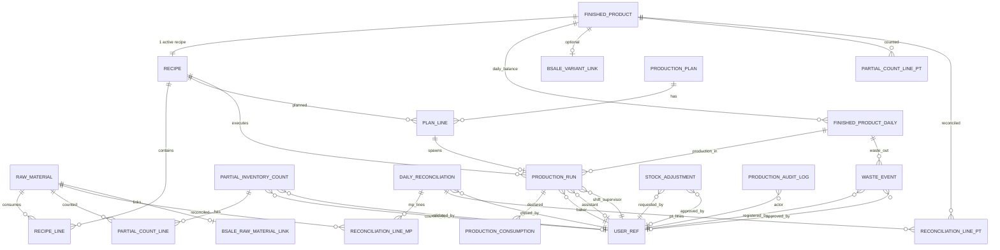
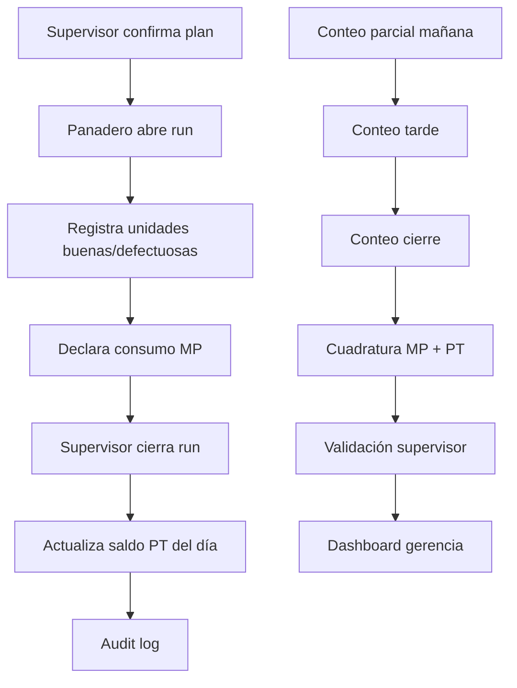
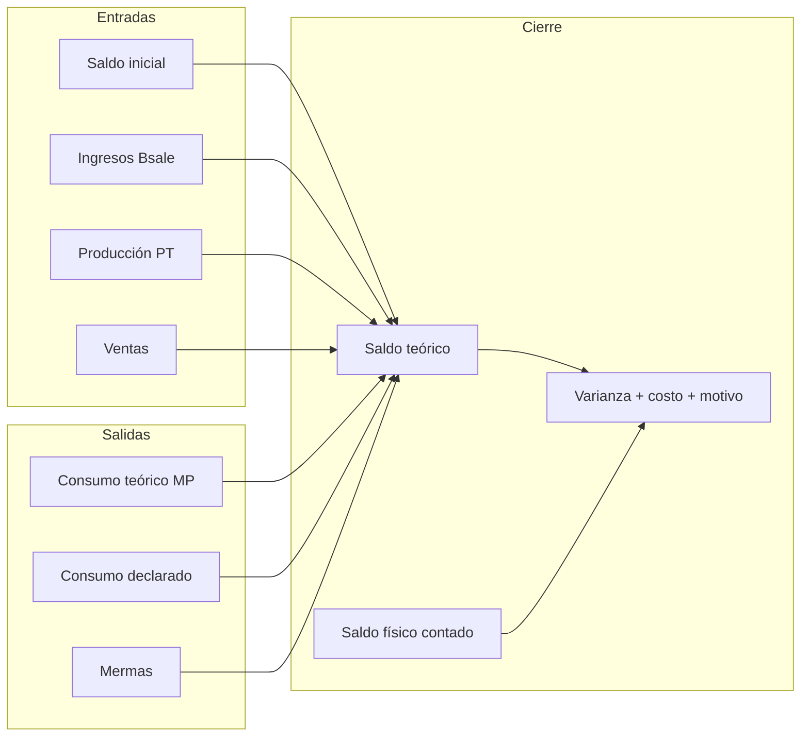
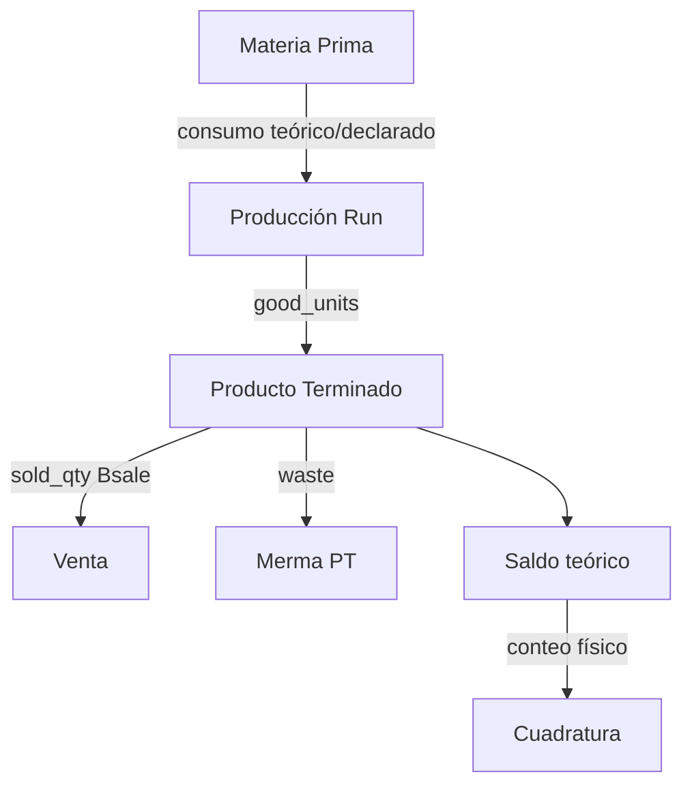
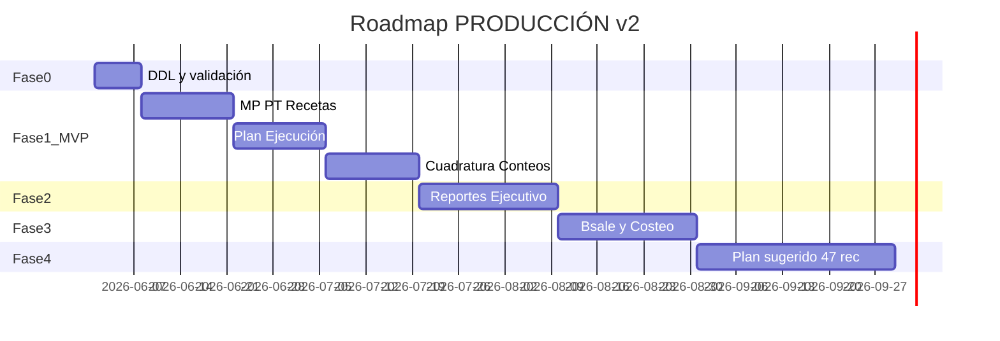

# Módulo PRODUCCIÓN — Arquitectura y plan de implementación

**Proyecto:** Quillotana ERP (`bsale-api-tools`)  
**Estado:** Diseño revisado / sin implementación  
**Versión:** 2.0 — Mayo 2026  
**Alcance:** Control de producción, rendimientos y cuadratura — panadería propia (~47 recetas dulces/saladas)

**Cambios v2.0:** responsables y auditoría, MPs críticas, conteos parciales, costeo histórico (preparación), producto terminado obligatorio, stock teórico vs físico unificado, roadmap sugerido, dashboard ejecutivo.

---

## 1. Resumen ejecutivo

### Problema

Bsale cubre compras, ingresos y stock comercial, pero **no** modela recetas, lotes, consumo teórico vs real, saldos físicos, mermas, producto terminado ni responsables por operación. Hoy eso vive en Excel.

### Solución propuesta

Dominio **PRODUCCIÓN** como fuente de verdad de:

| ERP (nuevo) | Bsale (existente) |
|-------------|-------------------|
| Recetas versionadas | Ingresos / compras |
| Plan y producción real | Ventas (snapshot) |
| Consumo declarado y cuadraturas | Stock variantes (referencia) |
| Mermas y rendimientos | Costos (si disponibles) |
| **Producto terminado** (producción → venta → saldo) | Variante vinculada |
| **Responsables y auditoría** por movimiento | — |

### Cadena de control obligatoria

```
Materia Prima → Producción → Producto Terminado → Venta → Saldo
     ↑              ↑              ↑
  Conteos      Responsables    Teórico vs Físico
  parciales    auditados       (MP y terminado)
```

### Principios de diseño

1. **Trazabilidad humana** — quién produjo, registró, contó, validó y aprobó.
2. **No duplicar ledger Bsale** — snapshots + movimientos internos `app.production_*`.
3. **Recetas inmutables por versión** — cambios = nueva versión.
4. **Producto terminado obligatorio** — no basta controlar solo MPs.
5. **Conteos parciales** — detectar en qué tramo aparece la diferencia.
6. **Costeo histórico preparado** — campos `unit_cost`, `cost_source`, `cost_date` desde el DDL (sin lógica completa en MVP).
7. **Multi-empresa** — `company_id` en todas las tablas operativas.

---

## 2. Alcance funcional por submódulo

### Menú principal: PRODUCCIÓN

| # | Submódulo | Ruta | MVP | Fase |
|---|-----------|------|-----|------|
| 1 | Dashboard producción | `/produccion` | Sí (operativo + vista ejecutiva básica) | 1 |
| 2 | Materias primas | `/produccion/materias-primas` | Sí (`is_critical`) | 1 |
| 3 | Recetas maestras | `/produccion/recetas` | Sí | 1 |
| 4 | Plan de producción | `/produccion/plan` | Sí | 1 |
| 5 | Producción real | `/produccion/ejecucion` | Sí (responsables) | 1 |
| 6 | Producto terminado | `/produccion/producto-terminado` | Sí (cuadratura PT) | 1 |
| 7 | Consumos y saldos | `/produccion/consumos` | Parcial | 1 |
| 8 | Mermas | `/produccion/mermas` | Registro + aprobación simple | 1–2 |
| 9 | Cuadratura diaria | `/produccion/cuadratura` | Sí + conteos parciales | 1 |
| 10 | Reportes | `/produccion/reportes` | Fase 2 | 2 |
| 11 | Plan sugerido (roadmap) | `/produccion/plan-sugerido` | No | 4 |

---

## 3. ERD actualizado



### Entidades núcleo (v2)

| Entidad | Tabla | Descripción |
|---------|-------|-------------|
| Materia prima | `raw_materials` | Insumo + `is_critical` |
| Producto terminado | `finished_products` | Hallulla, Marraqueta, etc. |
| Receta | `recipes` + `recipe_lines` | Versionada, enlaza a PT |
| Plan | `production_plans` + `plan_lines` | Plan diario por turno |
| Ejecución | `production_runs` | Producción real + responsables |
| Consumo | `production_consumptions` | Teórico vs declarado MP |
| Saldo PT diario | `finished_product_daily` | Producción − venta − merma = saldo |
| Conteo parcial | `partial_inventory_counts` | Mañana / tarde / cierre |
| Cuadratura | `daily_reconciliations` | Cierre MP + PT |
| Merma | `waste_events` | Registro + aprobación |
| Ajuste | `stock_adjustments` | Solicitud + aprobación |
| Auditoría | `production_audit_log` | Log inmutable de acciones |
| Movimiento | `production_stock_movements` | Ledger interno |

---

## 4. Responsables y trazabilidad

### 4.1 Objetivo

Responder con precisión:

- **Quién produjo**
- **Quién registró**
- **Quién contó**
- **Quién validó**
- **Quién aprobó**

### 4.2 Modelo de usuarios

Reutilizar `bsale.users` (email + role). En tablas operativas guardar:

- `*_user_id` (INTEGER, FK lógica a users) cuando exista
- `*_user_email` (VARCHAR, snapshot inmutable al momento del evento)

Patrón dual: ID para joins + email congelado para auditoría histórica aunque cambie el usuario.

### 4.3 Responsables por operación

| Operación | Campos | Obligatorio MVP |
|-----------|--------|-----------------|
| **Producción real** | `baker_user_id`, `assistant_user_id`, `shift_supervisor_user_id` | Panadero + supervisor |
| **Conteo parcial** | `counted_by_user_id`, `validated_by_user_id` | Contador |
| **Cuadratura cierre** | `closed_by_user_id`, `validated_by_user_id` | Contador + validador |
| **Merma** | `registered_by_user_id`, `approved_by_user_id` | Registro; aprobación supervisor |
| **Ajuste stock** | `requested_by_user_id`, `approved_by_user_id` | Ambos (ajuste no auto-aprobado) |

### 4.4 Tabla de auditoría

```sql
CREATE TABLE app.production_audit_log (
    id              BIGSERIAL PRIMARY KEY,
    company_id      INTEGER NOT NULL,
    event_time      TIMESTAMPTZ NOT NULL DEFAULT NOW(),
    actor_user_id   INTEGER,
    actor_email     VARCHAR(120) NOT NULL,
    entity_type     VARCHAR(40) NOT NULL,
    -- production_run|partial_count|reconciliation|waste|adjustment|recipe|...
    entity_id       INTEGER NOT NULL,
    action          VARCHAR(40) NOT NULL,
    -- create|update|close|approve|validate|reject
    payload_before  JSONB,
    payload_after   JSONB,
    ip_address      VARCHAR(45),
    notes           TEXT
);

CREATE INDEX idx_prod_audit_entity ON app.production_audit_log (entity_type, entity_id);
CREATE INDEX idx_prod_audit_time ON app.production_audit_log (company_id, event_time DESC);
```

**Regla:** toda transición de estado (`abierto` → `cerrado`, `borrador` → `aprobado`) inserta fila en `production_audit_log`.

---

## 5. Materias primas críticas

### Campo `is_critical`

```sql
-- En app.raw_materials
is_critical     BOOLEAN NOT NULL DEFAULT FALSE,
```

### Seed MVP (críticas)

Harina, Queso, Manteca, Chocolate, Cecina, Manjar

### Comportamiento

| Área | MPs críticas |
|------|----------------|
| Dashboard | Badge destacado, siempre visibles en top |
| Alertas | Umbral varianza más bajo (ej. 2% vs 5%) |
| Reportes | Sección prioritaria en Fase 2 |
| Cuadratura | Ordenadas al inicio de la grilla |
| Conteos parciales | Sugeridas en los 3 slots del día |

---

## 6. Conteos parciales

### Objetivo

No depender solo del cierre diario. Detectar **en qué tramo** aparece la diferencia.

### Slots estándar

| Slot | Código | Hora referencia |
|------|--------|-----------------|
| Mañana | `manana` | ~08:00 |
| Tarde | `tarde` | ~14:00 |
| Cierre | `cierre` | ~20:00 |

### Tablas

```sql
CREATE TABLE app.partial_inventory_counts (
    id              SERIAL PRIMARY KEY,
    company_id      INTEGER NOT NULL,
    count_date      DATE NOT NULL,
    count_slot      VARCHAR(20) NOT NULL,  -- manana|tarde|cierre
    counted_at      TIMESTAMPTZ NOT NULL DEFAULT NOW(),
    counted_by_user_id INTEGER,
    counted_by_email VARCHAR(120) NOT NULL,
    validated_by_user_id INTEGER,
    validated_by_email VARCHAR(120),
    validated_at    TIMESTAMPTZ,
    status          VARCHAR(20) NOT NULL DEFAULT 'borrador', -- borrador|validado
    notes           TEXT,
    UNIQUE (company_id, count_date, count_slot)
);

CREATE TABLE app.partial_count_lines_raw (
    id                  SERIAL PRIMARY KEY,
    partial_count_id    INTEGER NOT NULL REFERENCES app.partial_inventory_counts(id) ON DELETE CASCADE,
    raw_material_id     INTEGER NOT NULL REFERENCES app.raw_materials(id),
    physical_qty        NUMERIC(12,4) NOT NULL,
    unit                VARCHAR(20) NOT NULL,
    theoretical_qty     NUMERIC(12,4),       -- calculado al momento del conteo
    variance_qty        NUMERIC(12,4),
    variance_value      NUMERIC(12,2),
    unit_cost           NUMERIC(12,4),       -- snapshot costeo histórico
    cost_source         VARCHAR(30),
    cost_date           DATE,
    notes               TEXT,
    UNIQUE (partial_count_id, raw_material_id)
);

CREATE TABLE app.partial_count_lines_finished (
    id                  SERIAL PRIMARY KEY,
    partial_count_id    INTEGER NOT NULL REFERENCES app.partial_inventory_counts(id) ON DELETE CASCADE,
    finished_product_id INTEGER NOT NULL REFERENCES app.finished_products(id),
    physical_qty        NUMERIC(12,3) NOT NULL,
    unit                VARCHAR(20) NOT NULL,
    theoretical_qty     NUMERIC(12,3),
    variance_qty        NUMERIC(12,3),
    variance_value      NUMERIC(12,2),
    unit_cost           NUMERIC(12,4),
    cost_source         VARCHAR(30),
    cost_date           DATE,
    notes               TEXT,
    UNIQUE (partial_count_id, finished_product_id)
);
```

### Ejemplo operativo

```
18-06-2026 | Harina
08:00  físico 220 kg  (teórico 218)  Δ +2
14:00  físico 180 kg  (teórico 182)  Δ -2  ← desvío aparece en turno tarde
20:00  físico 145 kg  (teórico 148)  Δ -3
```

### MVP

- Estructura DDL incluida desde Fase 1
- UI mínima: registrar conteo mañana + cierre
- Conteo tarde completo en Fase 2

---

## 7. Producto terminado (obligatorio)

### Entidad

```sql
CREATE TABLE app.finished_products (
    id              SERIAL PRIMARY KEY,
    company_id      INTEGER NOT NULL,
    code            VARCHAR(30) NOT NULL,       -- HALLULLA
    name            VARCHAR(120) NOT NULL,
    recipe_id       INTEGER REFERENCES app.recipes(id),  -- receta activa
    unit            VARCHAR(20) NOT NULL DEFAULT 'unidad',
    bsale_variant_id INTEGER,
    bsale_barcode   VARCHAR(50),
    is_critical     BOOLEAN NOT NULL DEFAULT FALSE,
    active          BOOLEAN NOT NULL DEFAULT TRUE,
    created_at      TIMESTAMPTZ NOT NULL DEFAULT NOW(),
    UNIQUE (company_id, code)
);
```

### Saldo diario PT

```sql
CREATE TABLE app.finished_product_daily (
    id                  SERIAL PRIMARY KEY,
    company_id          INTEGER NOT NULL,
    balance_date        DATE NOT NULL,
    finished_product_id INTEGER NOT NULL REFERENCES app.finished_products(id),
    opening_qty         NUMERIC(12,3) NOT NULL DEFAULT 0,
    produced_qty        NUMERIC(12,3) NOT NULL DEFAULT 0,   -- sum runs
    sold_qty            NUMERIC(12,3) NOT NULL DEFAULT 0,   -- snapshot Bsale
    waste_qty           NUMERIC(12,3) NOT NULL DEFAULT 0,
    transfers_in        NUMERIC(12,3) NOT NULL DEFAULT 0,
    transfers_out       NUMERIC(12,3) NOT NULL DEFAULT 0,
    theoretical_closing NUMERIC(12,3) NOT NULL,               -- calculado
    physical_count      NUMERIC(12,3),
    variance_qty        NUMERIC(12,3),
    variance_pct        NUMERIC(8,4),
    variance_value      NUMERIC(12,2),
    unit_cost           NUMERIC(12,4),       -- costeo histórico preparado
    cost_source         VARCHAR(30),
    cost_date           DATE,
    variance_reason     VARCHAR(40),
    notes               TEXT,
    UNIQUE (company_id, balance_date, finished_product_id)
);
```

### Fórmulas PT

```
saldo_teorico_PT = apertura + produccion - ventas - mermas_PT ± transferencias

varianza_PT = conteo_fisico - saldo_teorico_PT
valor_varianza_PT = varianza_PT × unit_cost
```

### Ejemplo Hallulla (día)

| Concepto | Cantidad |
|----------|----------|
| Producción | 800 |
| Venta (Bsale) | 620 |
| Merma | 15 |
| **Saldo esperado** | **165** |
| Conteo físico | 150 |
| **Diferencia** | **-15** |

### Integración ventas Bsale (Fase 2 lectura)

Snapshot diario por `bsale_variant_id` vinculado → `sold_qty`. MVP: ingreso manual de ventas del día por PT.

---

## 8. Stock teórico vs stock físico (unificado)

### Vista conceptual (MP y PT)

| Campo | MP | Producto terminado |
|-------|----|--------------------|
| Teórico | `theoretical_closing` | `theoretical_closing` |
| Físico | `physical_count` | `physical_count` |
| Diferencia | `variance_qty` | `variance_qty` |
| % | `variance_pct` | `variance_pct` |
| Costo | `variance_value` | `variance_value` |

### Pantalla unificada Cuadratura

Dos pestañas o secciones en `/produccion/cuadratura`:

1. **Materias primas** — grilla con MPs críticas primero
2. **Producto terminado** — grilla por PT del día

Misma UX: Teórico | Físico | Diferencia | Costo | Motivo

---

## 9. Costeo histórico (preparación — sin implementar lógica en MVP)

### Campos estándar en tablas con impacto económico

```sql
unit_cost    NUMERIC(12,4),   -- costo unitario al momento del evento
cost_source  VARCHAR(30),     -- manual|bsale_oc|bsale_price_list|recipe_calc|avg_cost
cost_date    DATE             -- fecha de vigencia del costo usado
```

### Tablas que incluyen estos campos desde DDL

| Tabla | Uso futuro |
|-------|------------|
| `recipe_lines` | Costo ingrediente al calcular receta |
| `recipes` | `theoretical_cost` + snapshot cost_date |
| `production_consumptions` | Costo MP al cerrar run |
| `waste_events` | `estimated_cost` desglosado |
| `finished_product_daily` | Costo unitario PT del día |
| `partial_count_lines_*` | Valorización varianza |
| `daily_reconciliation_lines` | Ya tiene `variance_value` |
| `production_stock_movements` | Valor movimiento |

### Tabla opcional historial explícito (Fase 3)

```sql
CREATE TABLE app.cost_history_snapshots (
    id              SERIAL PRIMARY KEY,
    company_id      INTEGER NOT NULL,
    entity_type     VARCHAR(30) NOT NULL,  -- raw_material|finished_product|recipe
    entity_id       INTEGER NOT NULL,
    unit_cost       NUMERIC(12,4) NOT NULL,
    cost_source     VARCHAR(30) NOT NULL,
    cost_date       DATE NOT NULL,
    created_at      TIMESTAMPTZ NOT NULL DEFAULT NOW()
);
```

**Objetivo futuro:** comparar costo Hallulla enero vs junio sin rediseñar BD.

---

## 10. Esquema SQL completo actualizado (`app.*`)

Archivo: `backend/sql/produccion_module.sql`

### 10.1 Materias primas

```sql
CREATE TABLE app.raw_materials (
    id                  SERIAL PRIMARY KEY,
    company_id          INTEGER NOT NULL,
    code                VARCHAR(30) NOT NULL,
    name                VARCHAR(120) NOT NULL,
    category            VARCHAR(40) NOT NULL,
    purchase_unit       VARCHAR(20) NOT NULL,
    consumption_unit    VARCHAR(20) NOT NULL,
    conversion_factor   NUMERIC(12,4) NOT NULL DEFAULT 1,
    min_stock           NUMERIC(12,3),
    avg_cost            NUMERIC(12,2),
    unit_cost           NUMERIC(12,4),
    cost_source         VARCHAR(30),
    cost_date           DATE,
    is_critical         BOOLEAN NOT NULL DEFAULT FALSE,
    bsale_variant_id    INTEGER,
    bsale_barcode       VARCHAR(50),
    notes               TEXT,
    active              BOOLEAN NOT NULL DEFAULT TRUE,
    created_at          TIMESTAMPTZ NOT NULL DEFAULT NOW(),
    updated_at          TIMESTAMPTZ NOT NULL DEFAULT NOW(),
    created_by_email    VARCHAR(120),
    UNIQUE (company_id, code)
);
```

### 10.2 Producto terminado + recetas

```sql
CREATE TABLE app.finished_products ( ... );  -- ver sección 7

CREATE TABLE app.recipes (
  ...
  finished_product_id INTEGER REFERENCES app.finished_products(id),
  unit_cost           NUMERIC(12,4),
  cost_source         VARCHAR(30),
  cost_date           DATE,
  ...
);

CREATE TABLE app.recipe_lines (
  ...
  unit_cost           NUMERIC(12,4),
  cost_source         VARCHAR(30),
  cost_date           DATE,
  ...
);
```

### 10.3 Producción real (con responsables)

```sql
CREATE TABLE app.production_runs (
    id                      SERIAL PRIMARY KEY,
    company_id              INTEGER NOT NULL,
    plan_line_id            INTEGER REFERENCES app.production_plan_lines(id),
    recipe_id               INTEGER NOT NULL REFERENCES app.recipes(id),
    finished_product_id     INTEGER REFERENCES app.finished_products(id),
    run_date                DATE NOT NULL,
    shift                   VARCHAR(20) NOT NULL,
    baker_user_id           INTEGER,
    baker_email             VARCHAR(120) NOT NULL,
    assistant_user_id       INTEGER,
    assistant_email         VARCHAR(120),
    shift_supervisor_user_id INTEGER,
    shift_supervisor_email  VARCHAR(120) NOT NULL,
    actual_batches          NUMERIC(8,2) NOT NULL,
    good_units              NUMERIC(12,3) NOT NULL,
    defect_units            NUMERIC(12,3) NOT NULL DEFAULT 0,
    dough_kg                NUMERIC(12,3),
    started_at              TIMESTAMPTZ,
    finished_at             TIMESTAMPTZ,
    status                  VARCHAR(20) NOT NULL DEFAULT 'abierto',
    registered_by_user_id   INTEGER,
    registered_by_email     VARCHAR(120) NOT NULL,
    closed_by_user_id       INTEGER,
    closed_by_email         VARCHAR(120),
    closed_at               TIMESTAMPTZ,
    notes                   TEXT,
    created_at              TIMESTAMPTZ NOT NULL DEFAULT NOW()
);

CREATE TABLE app.production_consumptions (
    ...
    unit_cost       NUMERIC(12,4),
    cost_source     VARCHAR(30),
    cost_date       DATE,
    ...
);
```

### 10.4 Mermas (registro + aprobación)

```sql
CREATE TABLE app.waste_events (
    ...
    registered_by_user_id   INTEGER,
    registered_by_email     VARCHAR(120) NOT NULL,
    approved_by_user_id     INTEGER,
    approved_by_email       VARCHAR(120),
    approved_at             TIMESTAMPTZ,
    status                  VARCHAR(20) NOT NULL DEFAULT 'pendiente', -- pendiente|aprobado|rechazado
    unit_cost               NUMERIC(12,4),
    cost_source             VARCHAR(30),
    cost_date               DATE,
    estimated_cost          NUMERIC(12,2),
    ...
);
```

### 10.5 Ajustes de stock

```sql
CREATE TABLE app.stock_adjustments (
    id                  SERIAL PRIMARY KEY,
    company_id          INTEGER NOT NULL,
    adjustment_date     DATE NOT NULL,
    entity_type         VARCHAR(20) NOT NULL,  -- raw_material|finished_product
    raw_material_id     INTEGER REFERENCES app.raw_materials(id),
    finished_product_id INTEGER REFERENCES app.finished_products(id),
    quantity            NUMERIC(12,4) NOT NULL,
    unit                VARCHAR(20) NOT NULL,
    direction           VARCHAR(10) NOT NULL,  -- in|out
    reason_code         VARCHAR(40) NOT NULL,
    requested_by_user_id INTEGER,
    requested_by_email  VARCHAR(120) NOT NULL,
    approved_by_user_id INTEGER,
    approved_by_email   VARCHAR(120),
    approved_at         TIMESTAMPTZ,
    status              VARCHAR(20) NOT NULL DEFAULT 'pendiente',
    unit_cost           NUMERIC(12,4),
    cost_source         VARCHAR(30),
    cost_date           DATE,
    notes               TEXT,
    created_at          TIMESTAMPTZ NOT NULL DEFAULT NOW()
);
```

### 10.6 Cuadratura diaria (MP + PT)

```sql
CREATE TABLE app.daily_reconciliations (
    id                  SERIAL PRIMARY KEY,
    company_id          INTEGER NOT NULL,
    recon_date          DATE NOT NULL,
    status              VARCHAR(20) NOT NULL DEFAULT 'borrador',
    counted_by_user_id  INTEGER,
    counted_by_email    VARCHAR(120),
    validated_by_user_id INTEGER,
    validated_by_email  VARCHAR(120),
    validated_at        TIMESTAMPTZ,
    closed_by_user_id   INTEGER,
    closed_by_email     VARCHAR(120),
    closed_at           TIMESTAMPTZ,
    notes               TEXT,
    UNIQUE (company_id, recon_date)
);

CREATE TABLE app.daily_reconciliation_lines_mp ( ... );  -- igual v1 + cost fields
CREATE TABLE app.daily_reconciliation_lines_pt (
    id                  SERIAL PRIMARY KEY,
    reconciliation_id   INTEGER NOT NULL REFERENCES app.daily_reconciliations(id) ON DELETE CASCADE,
    finished_product_id INTEGER NOT NULL REFERENCES app.finished_products(id),
    opening_qty         NUMERIC(12,3) NOT NULL DEFAULT 0,
    produced_qty        NUMERIC(12,3) NOT NULL DEFAULT 0,
    sold_qty            NUMERIC(12,3) NOT NULL DEFAULT 0,
    waste_qty           NUMERIC(12,3) NOT NULL DEFAULT 0,
    theoretical_closing NUMERIC(12,3) NOT NULL,
    physical_count      NUMERIC(12,3),
    variance_qty        NUMERIC(12,3),
    variance_pct        NUMERIC(8,4),
    variance_value      NUMERIC(12,2),
    unit_cost           NUMERIC(12,4),
    cost_source         VARCHAR(30),
    cost_date           DATE,
    variance_reason     VARCHAR(40),
    notes               TEXT,
    UNIQUE (reconciliation_id, finished_product_id)
);
```

### 10.7 Ledger + auditoría

`app.production_stock_movements` (v1) + `app.production_audit_log` (sección 4.4)

### 10.8 Vistas

```sql
-- app.vw_production_run_summary
-- app.vw_finished_product_daily_balance
-- app.vw_critical_material_variance
-- app.vw_partial_count_variance_by_slot
-- app.vw_executive_production_dashboard
-- app.vw_responsible_incident_ranking
```

---

## 11. Flujos operativos

### 11.1 Flujo diario de producción



### 11.2 Flujo de cuadratura



### 11.3 Flujo cadena completa (MP → PT → venta)



### 11.4 Flujo merma y ajuste

```
Operador registra merma → status pendiente
Supervisor aprueba/rechaza → audit log
Si aprobado → impacta saldo teórico del día

Operador solicita ajuste → status pendiente
Supervisor aprueba → movimiento ledger + audit log
```

---

## 12. Integración Bsale (actualizada)

| Dato Bsale | Uso producción | Fase |
|------------|----------------|------|
| Compras / OC | Ingresos MP en cuadratura | 2 |
| Ventas documentos | `sold_qty` PT | 2 |
| Stock variantes | Referencia cruzada | 2 |
| Variants | Link MP y PT | 1 (opcional) |
| Costos OC | `unit_cost` + `cost_source=bsale_oc` | 3 |

**MVP:** ventas PT y algunos ingresos MP pueden ser **manuales** con diseño listo para automatizar.

---

## 13. API Backend (endpoints nuevos/actualizados)

Prefijo: `/produccion`

### Nuevos dominios v2

| Método | Ruta | Descripción |
|--------|------|-------------|
| GET/POST | `/produccion/finished-products` | CRUD PT |
| GET | `/produccion/finished-products/daily` | Saldos del día |
| PATCH | `/produccion/finished-products/daily/{id}` | Conteo físico PT |
| GET/POST | `/produccion/partial-counts` | Conteos parciales |
| POST | `/produccion/partial-counts/{id}/validate` | Validar conteo |
| POST | `/produccion/waste/{id}/approve` | Aprobar merma |
| POST | `/produccion/adjustments` | Solicitar ajuste |
| POST | `/produccion/adjustments/{id}/approve` | Aprobar ajuste |
| GET | `/produccion/audit-log` | Trazabilidad |
| GET | `/produccion/dashboard/executive` | KPIs ejecutivos (Fase 2) |
| GET | `/produccion/plan-suggested` | Roadmap Fase 4 — no MVP |

### Producción real (campos responsables)

`POST /produccion/runs` body incluye: `baker_email`, `assistant_email`, `shift_supervisor_email`

---

## 14. Frontend (actualizado)

### Rutas nuevas

| Ruta | Descripción |
|------|-------------|
| `/produccion/producto-terminado` | Saldos PT del día |
| `/produccion/cuadratura` | MP + PT + conteos parciales |
| `/produccion/plan-sugerido` | Fase 4 (deshabilitado en menú hasta entonces) |

### Componentes nuevos

```
frontend/components/produccion/
├── responsible-user-select.tsx
├── partial-count-slot-form.tsx
├── finished-product-daily-grid.tsx
├── theoretical-vs-physical-card.tsx      -- MP y PT
├── critical-material-badge.tsx
├── waste-approval-dialog.tsx
├── stock-adjustment-request-form.tsx
├── audit-log-timeline.tsx
├── executive-dashboard.tsx               -- Fase 2
└── plan-suggested-panel.tsx              -- Fase 4 placeholder
```

---

## 15. Dashboard

### 15.1 Dashboard operativo (MVP — Fase 1)

- Producciones del día
- Recetas ejecutadas
- Merma total y %
- MPs críticas con varianza
- PT: teórico vs físico resumido
- Planificado vs real

### 15.2 Dashboard ejecutivo (Fase 2 — indicadores futuros)

| Indicador | Descripción |
|-----------|-------------|
| Diferencias MPs | Valor $ agregado del día |
| Diferencias PT | Valor $ agregado del día |
| Top pérdidas económicas | MP + PT combinado |
| Top recetas con desviación | Rendimiento plan vs real |
| Top responsables con incidencias | Por merma, varianza, ajustes |
| Tendencia 7/30 días | Sparklines |

---

## 16. Roadmap — Plan de producción sugerido (Fase 4)

**No implementar en MVP.** Diseñar menú y endpoint placeholder.

### Objetivo

Calcular producción recomendada usando:

- Ventas históricas (Bsale)
- Saldos finales del día anterior
- Día de semana / estacionalidad
- Eventos especiales (feriados, promociones)

### Ejemplo salida

```
Hallulla:    620 unidades sugeridas
Marraqueta:  480 unidades sugeridas
Berlín:      180 unidades sugeridas
```

### Tabla preparatoria (DDL Fase 0, uso Fase 4)

```sql
CREATE TABLE app.production_suggestions (
    id                  SERIAL PRIMARY KEY,
    company_id          INTEGER NOT NULL,
    suggestion_date     DATE NOT NULL,
    finished_product_id INTEGER NOT NULL REFERENCES app.finished_products(id),
    suggested_qty       NUMERIC(12,3) NOT NULL,
    algorithm_version   VARCHAR(20) NOT NULL,
    inputs_json         JSONB NOT NULL,
    created_at          TIMESTAMPTZ NOT NULL DEFAULT NOW(),
    UNIQUE (company_id, suggestion_date, finished_product_id)
);
```

---

## 17. Permisos (actualizado)

| Rol | Permisos |
|-----|----------|
| `produccion_operador` | Runs, consumos, mermas (pendiente), conteos (sin validar) |
| `produccion_supervisor` | Validar conteos, aprobar mermas, cerrar runs, cuadratura |
| `produccion_admin` | Recetas, MPs, PT, ajustes aprobados, reportes |
| `gerencia` / `admin` | Dashboard ejecutivo, auditoría completa |

---

## 18. Roadmap de fases (definitivo)

### Fase 0 — Preparación (1 semana)

- [ ] Sign-off documento v2.0
- [ ] DDL completo `produccion_module.sql` (incluye PT, conteos, auditoría, cost fields)
- [ ] Inventario 10 recetas + MPs críticas
- [ ] Definir usuarios panadero / supervisor piloto

### Fase 1 — MVP operativo (5–7 semanas)

| Entrega | Detalle |
|---------|---------|
| Materias primas | CRUD + `is_critical` + cost fields (sin lógica histórica) |
| Producto terminado | CRUD + saldo diario manual ventas |
| Recetas | 10 recetas vinculadas a PT |
| Plan + ejecución | Responsables panadero/supervisor |
| Consumo declarado | Teórico vs declarado MP |
| Conteos parciales | Mañana + cierre (mínimo) |
| Cuadratura | MP + PT, teórico/físico/diferencia/$ |
| Mermas | Registro; aprobación supervisor básica |
| Dashboard operativo | MPs críticas + PT + merma % |
| Auditoría | `production_audit_log` en cierres |

**Fuera MVP Fase 1:** plan sugerido, dashboard ejecutivo completo, sync ventas Bsale, costeo histórico comparativo, fotos merma.

### Fase 2 — Control y reportes (3–4 semanas)

- Conteo tarde completo + varianza por tramo
- Dashboard ejecutivo (top pérdidas, responsables, recetas)
- Reportes ranking y export Excel
- Ledger `production_stock_movements`
- Sync ventas Bsale → `sold_qty`
- Ajustes stock con flujo aprobación completo

### Fase 3 — Integración Bsale y costeo (3–4 semanas)

- Ingresos MP automáticos desde OC
- `cost_history_snapshots` poblado
- Comparativo costo receta por mes
- Link PT ↔ variante Bsale bidireccional
- Propuesta ajuste stock Bsale (aprobación manual)

### Fase 4 — Escala e inteligencia (continuo)

- 47 recetas migradas
- **Plan de producción sugerido** (algoritmo + UI)
- Estacionalidad y eventos
- App tablet panadero
- Fotos merma



---

## 19. MVP definitivo

### Incluye (obligatorio go-live)

1. **15 MPs** con 6 críticas marcadas  
2. **10 recetas** saladas/dulces vinculadas a **producto terminado**  
3. **Plan diario** por turno con consumo teórico calculado  
4. **Producción real** con panadero + supervisor responsables  
5. **Saldo PT diario:** producción − ventas (manual) − merma = teórico vs físico  
6. **Consumo MP:** teórico vs declarado por run  
7. **Conteos parciales:** al menos mañana + cierre  
8. **Cuadratura:** MP + PT con diferencia en kg/unidades y $  
9. **Mermas:** registro + aprobación supervisor  
10. **Auditoría:** log en cierres y aprobaciones  
11. **Dashboard operativo** con MPs críticas destacadas  

### No incluye (post-MVP)

- Plan de producción sugerido (Fase 4)  
- Dashboard ejecutivo completo (Fase 2)  
- Costeo histórico comparativo mensual (Fase 3)  
- Sync automático ventas/ingresos Bsale (Fase 2–3)  
- 47 recetas (Fase 4)  
- Fotos en mermas  

### 10 recetas piloto

**Saladas:** Hallulla, Marraqueta, Pan amasado, Doble cilindro, Coliza, Pan de molde  
**Dulces:** Berlín, Sopaipilla, Brazo de reina, Galleta dulce base

### Criterios de éxito MVP

- [ ] Cadena MP → producción → PT → venta → saldo operativa sin Excel  
- [ ] Cuadratura MP + PT en &lt; 20 min  
- [ ] Trazabilidad: responsable en cada run y cada cierre  
- [ ] Varianza MPs críticas visible en dashboard el mismo día  
- [ ] Detectar tramo de desvío vía conteo mañana vs cierre  
- [ ] Histórico inmutable de receta por run  

---

## 20. Riesgos técnicos (actualizado)

| Riesgo | Impacto | Mitigación |
|--------|---------|------------|
| Complejidad PT + MP duplica esfuerzo UI | Alto | Pantalla cuadratura unificada, componentes compartidos |
| Ventas Bsale no disponibles por PT | Alto | Ingreso manual MVP; link variante Fase 2 |
| Sobrecarga auditoría | Medio | Log solo en transiciones de estado |
| Responsables no usan login individual | Medio | Selector de usuario en tablet; email obligatorio |
| Conteos parciales no se hacen | Medio | Recordatorio dashboard; solo 2 slots en MVP |
| Campos costeo sin usar confunden | Bajo | Documentar "preparación Fase 3"; nullable |

---

## 21. Migraciones

| Archivo | Contenido |
|---------|-----------|
| `backend/sql/produccion_module.sql` | DDL completo v2 |
| `backend/sql/app_produccion_seed_mvp.sql` | MPs, 10 recetas, 10 PT |
| `backend/sql/app_produccion_views.sql` | Vistas dashboard |
| `backend/sql/app_produccion_audit.sql` | Solo audit log si se separa |

---

## 22. Decisiones cerradas en v2

| Tema | Decisión |
|------|----------|
| Producto terminado en MVP | **Sí, obligatorio** |
| Cuadratura | **MP + PT en misma pantalla** |
| Conteos parciales | **Estructura 3 slots; MVP 2 slots** |
| Responsables | **Email snapshot + user_id** |
| Costeo histórico | **Campos en DDL; lógica Fase 3** |
| Plan sugerido | **Fase 4, tabla preparada** |

## 23. Decisiones abiertas (validar negocio)

1. ¿Ventas PT manual o esperar sync Bsale para go-live?  
2. ¿Un conteo parcial obligatorio o opcional?  
3. ¿Aprobación merma en mismo turno o al día siguiente?  

---

## 24. Próximo paso

1. Revisión documento v2.0 con panadería + gerencia.  
2. Validar MVP definitivo (sección 19).  
3. Aprobar DDL Fase 0.  
4. **No implementar código hasta sign-off explícito.**

---

*Quillotana ERP — Módulo PRODUCCIÓN — Arquitectura v2.0*
