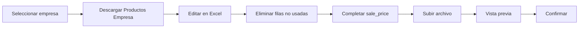
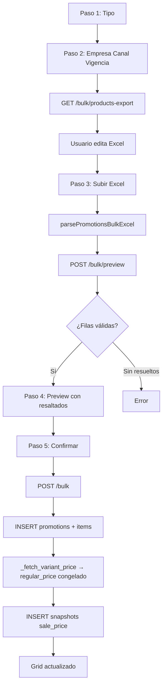
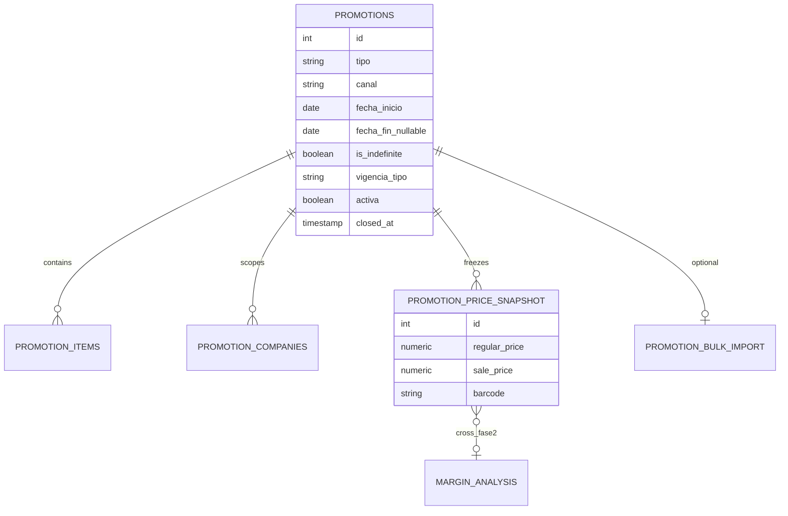
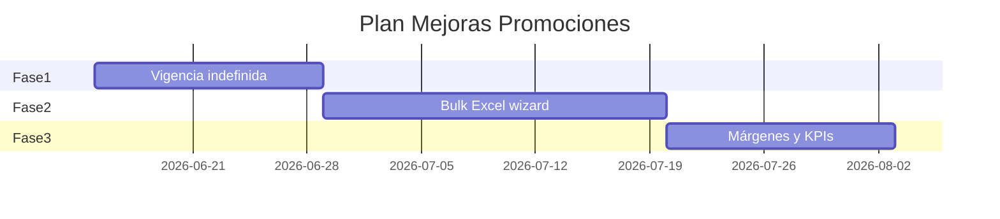

# Mejoras módulo Promociones — Ofertas y Remates

**Proyecto:** Quillotana ERP (`bsale-api-tools`)  
**Estado:** ✅ Aprobado — pendiente implementación (sign-off operación, mayo 2026)  
**Versión:** 1.1 — Mayo 2026  
**Alcance:** Vigencia indefinida, carga masiva Excel, **Excel generado por ERP**, integración futura con Márgenes

**Restricción absoluta:** no modificar ni recalcular `regular_price` / `sale_price` en `app.promotion_price_snapshot` existentes.

---

## 1. Resumen ejecutivo

### Problema actual

El módulo en `/promotions` exige **fecha_inicio + fecha_fin** para toda promoción. Eso no refleja la operación real de supermercados y minimarkets:

- Remates por vencimiento próximo
- Liquidación de stock / descontinuados
- Productos de baja rotación
- Ofertas que duran hasta agotar o hasta cierre manual

Además, la creación es **solo individual** (el asistente masivo Excel está deshabilitado en UI) y **Analítica → Márgenes** genera falsos positivos cuando el precio promocional baja el margen bajo el mínimo.

### Solución propuesta

| Mejora | Descripción |
|--------|-------------|
| Vigencia indefinida | `is_indefinite` + `fecha_fin` opcional; cierre manual |
| Estado Indefinida | Nunca vence por calendario |
| Carga masiva Excel | Asistente 5 pasos + preview + snapshots |
| **Excel generado por ERP** | Botón «Descargar Productos Empresa» con catálogo + precios |
| Cruce Márgenes | Nuevo status `PROMO_ACTIVE` en vista analítica |
| Dashboard comercial | Arquitectura preparada (Fase 3) |

### Lo que NO cambia

- Tabla `app.promotion_price_snapshot` y columnas `regular_price`, `sale_price`
- Congelamiento de precios al crear promoción
- `PATCH /promotions/snapshots/{id}/sale-price` (solo `sale_price` editable)
- Snapshots históricos inmutables

---

## 2. Estado actual (referencia código)

| Área | Ubicación |
|------|-----------|
| SQL módulo | `backend/sql/promotions_module.sql` |
| API | `backend/routers/promotions.py` |
| UI | `frontend/app/(dashboard)/promotions/page.tsx` |
| Componentes | `frontend/components/promotions/*` |
| Utils | `frontend/lib/promotions-utils.ts` |
| Márgenes vista | `backend/sql/margin_analysis_view.sql` |
| Márgenes UI | `frontend/app/(dashboard)/margins/page.tsx` |
| Excel barcode | `frontend/lib/etiquetas-excel.ts` (reutilizable) |

### Derivación estado actual (grid)

```sql
CASE
  WHEN NOT p.activa THEN 'Inactiva'
  WHEN CURRENT_DATE < p.fecha_inicio THEN 'Programada'
  WHEN CURRENT_DATE > p.fecha_fin THEN 'Vencida'
  ELSE 'Activa'
END
```

### Snapshot activo actual

```sql
AND p.activa = TRUE
AND CURRENT_DATE BETWEEN p.fecha_inicio AND p.fecha_fin
```

**Gap:** promociones sin `fecha_fin` o remates indefinidos no son posibles hoy.

---

## 3. Diseño UI

### 3.1 Formulario crear promoción (individual)

```
┌─────────────────────────────────────────────────────────┐
│ Nueva promoción                                         │
├─────────────────────────────────────────────────────────┤
│ Tipo:     [Oferta ▼]   Canal: [Detalle ▼]              │
│                                                         │
│ Vigencia:                                               │
│   ○ Fecha fija                                          │
│   ○ Indefinida  ♾                                       │
│                                                         │
│ [Fecha inicio: ____]  [Fecha fin: ____]  ← solo fija   │
│                                                         │
│ Lista: Supermercado La Quillotana (automática)          │
│ Empresas: [x] La Quillotana  [x] Minimarket            │
│ Productos: ...                                          │
└─────────────────────────────────────────────────────────┘
```

**Reglas UX:**

| Vigencia | fecha_inicio | fecha_fin | Visual tarjeta |
|----------|--------------|-----------|----------------|
| Fecha fija | obligatoria | obligatoria | `01/06 – 30/06` |
| Indefinida | obligatoria | oculta | `♾ Vigencia indefinida` |

**Cierre manual:** botón «Finalizar promoción» en detalle / historial → `activa = false`, `closed_at` registrado.

### 3.2 Badges de estado (actualizados)

| API `estado` | UI visual | Color |
|--------------|-----------|-------|
| `Activa` | Activa | verde |
| `Programada` | Próxima | azul |
| `Vencida` | Vencida | gris |
| `Inactiva` | Pausada | ámbar |
| `Indefinida` | Indefinida ♾ | violeta |

Pestañas existentes:

- **Activas:** `Activa` + `Indefinida` (no `Vencida`)
- **Historial:** todas; filtro por estado
- **Calendario:** `Indefinida` con estilo distinto (borde violeta)

### 3.3 Asistente creación masiva (nuevo)

Reemplaza el botón deshabilitado «Carga masiva Excel» en `page.tsx`.

```
Paso 1 — Tipo          Paso 2 — Contexto              Paso 3 — Excel
[Oferta] [Remate]      Empresa: La Quillotana Spa     ┌─────────────────────────────┐
[Promoción]            Canal, Vigencia (fija/♾)       │ [Descargar Productos Empresa]│
                       Lista: Supermercado La...      │ [Subir Excel editado]       │
                       Precio global (fallback)       └─────────────────────────────┘
                       Fechas si aplica

Paso 4 — Vista previa                    Paso 5 — Confirmar
┌──────────┬─────────┬──────────┬────────┬──────────┬────┐
│ Producto │ Variante│ Código   │ Actual │ Oferta   │ %  │
├──────────┼─────────┼──────────┼────────┼──────────┼────┤
│ CRISTAL  │ LATA... │ 78021... │ $1.490 │ $700     │-53%│
│ ...      │         │          │        │          │    │
└──────────┴─────────┴──────────┴────────┴──────────┴────┘
⚠ 2 no encontrados | ⚠ 1 duplicado | ⚠ 3 precio inválido
                    [Confirmar 48 promociones]
```

**Una promoción cabecera + N items** (modelo actual): el bulk crea **una** campaña con múltiples `promotion_items` y snapshots por barcode/empresa — no N cabeceras separadas.

### 3.4 Botón «Descargar Productos Empresa» (Excel generado por ERP)

**Ubicación:** Promociones → Crear masiva → Paso 2 o 3 (junto al upload).

**Habilitación:** requiere empresa seleccionada. Lista de precios se resuelve automáticamente vía `mapped_price_list_for_company` (`backend/utils/promotion_price_list_map.py`).

```
┌──────────────────────────────────────────────────────────────┐
│ Empresa:  [La Quillotana Spa ▼]                              │
│ Lista:    Supermercado La Quillotana (automática)            │
│                                                              │
│  [↓ Descargar Productos Empresa]   ← genera .xlsx completo   │
│  [↑ Subir Excel editado]                                     │
└──────────────────────────────────────────────────────────────┘
```

**Objetivo:** eliminar digitación manual de códigos de barras. El usuario descarga el catálogo, **elimina filas que no usará**, completa `sale_price` y sube el mismo archivo.

### 3.5 Formato Excel generado por el ERP

Columnas (orden fijo en export):

| codigo_barra | producto | variante | categoria | precio_actual | sale_price |
|--------------|----------|----------|-----------|---------------|------------|
| 7802100505323 | Cristal | Retornable 1.2L | Cervezas | 1490 | |
| 7802100001719 | Becker | Lata 470cc | Cervezas | 1290 | |

**Reglas export:**

| Campo | Origen BD | Notas |
|-------|-----------|-------|
| `codigo_barra` | `bsale.variants.bar_code` | Texto; sin notación científica; ceros iniciales preservados |
| `producto` | `bsale.products.name` | |
| `variante` | `bsale.variants.description` | |
| `categoria` | `bsale.product_types.name` | Vacío si sin tipo |
| `precio_actual` | `variant_prices.price_gross` | Lista mapeada de la empresa |
| `sale_price` | *(vacío)* | Columna en blanco para completar en Excel |

**Filtros export:**

- Solo variantes con `bar_code` no vacío
- Solo con precio > 0 en la lista de la empresa
- Orden: `categoria`, `producto`, `variante`
- Sin límite práctico en export (típico 3k–15k filas); streaming si > 10k

**Nombre archivo:** `promociones_productos_{empresa_slug}_{YYYYMMDD}.xlsx`

**Hoja meta (opcional):** segunda pestaña `_meta` con `company_id`, `company_name`, `price_list`, `generated_at` — ignorada en import.

### 3.6 Plantilla mínima (alternativa)

Para casos sin descarga completa (p. ej. lista corta manual):

| codigo_barra | sale_price (opcional) |
|--------------|----------------------|
| 7802100505323 | 700 |
| 7802100001719 | |

Botón secundario: «Plantilla vacía» (`GET /promotions/bulk/template`).

### 3.7 Flujo usuario (Excel ERP)



**Tiempo objetivo:** promoción de ~100 productos en **menos de 5 minutos** (sin copiar códigos a mano).

### 3.8 Vista previa — resaltados

| Condición | Estilo | Bloquea confirmar |
|-----------|--------|-------------------|
| Producto no encontrado | Fila roja + icono ⚠ | No (se excluyen al confirmar) |
| Código duplicado en archivo | Fila ámbar; solo primera fila válida | No |
| `sale_price` vacío sin precio pantalla | Fila ámbar «Falta precio» | **Sí** |
| `sale_price` ≤ 0 o no numérico | Fila roja «Precio inválido» | **Sí** |
| `sale_price` ≥ precio actual | Fila ámbar «Sin descuento» | Advertencia |
| OK | Fila normal | — |

Columnas preview: **Producto**, **Variante**, **Código**, **Precio actual**, **Precio oferta**, **Descuento %**.

`precio_actual` en preview siempre desde BD al momento del preview (`regular_price` congelado al confirmar).

---

## 4. Cambios base de datos

Archivo migración: `backend/sql/app_promotions_indefinite_vigencia.sql`

### 4.1 Tabla `app.promotions`

```sql
ALTER TABLE app.promotions
    ADD COLUMN IF NOT EXISTS is_indefinite BOOLEAN NOT NULL DEFAULT FALSE,
    ADD COLUMN IF NOT EXISTS vigencia_tipo VARCHAR(20) NOT NULL DEFAULT 'fecha_fija',
    ADD COLUMN IF NOT EXISTS closed_at TIMESTAMPTZ,
    ADD COLUMN IF NOT EXISTS closed_by_email VARCHAR(120),
    ADD COLUMN IF NOT EXISTS closed_reason TEXT;

-- fecha_fin nullable para indefinidas
ALTER TABLE app.promotions
    ALTER COLUMN fecha_fin DROP NOT NULL;

ALTER TABLE app.promotions
    DROP CONSTRAINT IF EXISTS promotions_vigencia_chk;

ALTER TABLE app.promotions
    ADD CONSTRAINT promotions_vigencia_chk CHECK (
        (is_indefinite = FALSE AND vigencia_tipo = 'fecha_fija' AND fecha_fin IS NOT NULL)
        OR
        (is_indefinite = TRUE AND vigencia_tipo = 'indefinida' AND fecha_fin IS NULL)
    );

ALTER TABLE app.promotions
    ADD CONSTRAINT promotions_vigencia_tipo_chk CHECK (
        vigencia_tipo IN ('fecha_fija', 'indefinida')
    );
```

**Nota:** filas existentes siguen con `is_indefinite = false`, `fecha_fin` NOT NULL — sin migración de datos.

### 4.2 Tabla bulk jobs (opcional Fase 2, recomendado diseño)

```sql
CREATE TABLE IF NOT EXISTS app.promotion_bulk_imports (
    id              SERIAL PRIMARY KEY,
    company_id      INTEGER NOT NULL,
    promotion_id    INTEGER REFERENCES app.promotions(id),
    tipo            VARCHAR(20) NOT NULL,
    canal           VARCHAR(20) NOT NULL,
    is_indefinite   BOOLEAN NOT NULL DEFAULT FALSE,
    fecha_inicio    DATE NOT NULL,
    fecha_fin       DATE,
    items_total     INTEGER NOT NULL DEFAULT 0,
    items_created   INTEGER NOT NULL DEFAULT 0,
    items_failed    INTEGER NOT NULL DEFAULT 0,
  errors_json     JSONB,
    created_by_email VARCHAR(120),
    created_at      TIMESTAMPTZ NOT NULL DEFAULT NOW()
);
```

### 4.3 Vista estado unificada (recomendado)

```sql
CREATE OR REPLACE VIEW app.vw_promotion_estado AS
SELECT
    p.id,
    p.is_indefinite,
    CASE
        WHEN NOT p.activa THEN 'Inactiva'
        WHEN p.is_indefinite AND p.activa
             AND CURRENT_DATE >= p.fecha_inicio THEN 'Indefinida'
        WHEN CURRENT_DATE < p.fecha_inicio THEN 'Programada'
        WHEN NOT p.is_indefinite
             AND p.fecha_fin IS NOT NULL
             AND CURRENT_DATE > p.fecha_fin THEN 'Vencida'
        ELSE 'Activa'
    END AS estado
FROM app.promotions p;
```

### 4.4 Preparación dashboard comercial (sin poblar)

```sql
CREATE OR REPLACE VIEW app.vw_promotion_commercial_kpis AS
SELECT
    ps.company_id,
    COUNT(DISTINCT ps.promotion_id) FILTER (
        WHERE ve.estado IN ('Activa', 'Indefinida')
    ) AS promociones_activas,
    COUNT(DISTINCT ps.promotion_id) FILTER (
        WHERE p.tipo = 'remate' AND ve.estado IN ('Activa', 'Indefinida')
    ) AS remates_activos,
    COUNT(DISTINCT ps.promotion_id) FILTER (
        WHERE p.is_indefinite AND ve.estado = 'Indefinida'
    ) AS promociones_indefinidas,
    COUNT(DISTINCT ps.barcode) AS productos_en_promocion
    -- Fase 3: impacto_estimado, ventas_con_promocion (JOIN ventas Bsale)
FROM app.promotion_price_snapshot ps
INNER JOIN app.promotions p ON p.id = ps.promotion_id
INNER JOIN app.vw_promotion_estado ve ON ve.id = p.id
GROUP BY ps.company_id;
```

### 4.5 Sin cambios en snapshot

`app.promotion_price_snapshot` — **ninguna columna nueva obligatoria**. Opcional futuro:

```sql
-- Solo si se necesita auditoría bulk; NO en Fase 1
-- bulk_import_id INTEGER REFERENCES app.promotion_bulk_imports(id)
```

---

## 5. Lógica de negocio actualizada

### 5.1 ¿Cuándo está activa una promoción?

```python
def promotion_is_live(p, today) -> bool:
    if not p.activa:
        return False
    if today < p.fecha_inicio:
        return False
    if p.is_indefinite:
        return True  # nunca vence por fecha
    return p.fecha_fin is not None and today <= p.fecha_fin
```

### 5.2 Cierre manual

```
POST /promotions/{id}/close
→ activa = false
→ closed_at = now()
→ closed_by_email = usuario JWT
→ estado derivado: Inactiva (Pausada en UI)
```

No eliminar filas. Snapshots permanecen para historial y etiquetas.

### 5.3 `_active_snapshot_sql_extra()` actualizado

```sql
AND p.activa = TRUE
AND CURRENT_DATE >= p.fecha_inicio
AND (
    p.is_indefinite = TRUE
    OR (p.fecha_fin IS NOT NULL AND CURRENT_DATE <= p.fecha_fin)
)
```

### 5.4 Validación create

| Campo | Fecha fija | Indefinida |
|-------|------------|------------|
| fecha_inicio | requerida | requerida |
| fecha_fin | requerida, ≥ inicio | **prohibida** (NULL) |
| is_indefinite | false | true |

---

## 6. Endpoints nuevos y cambios

### 6.1 Cambios en existentes

| Método | Ruta | Cambio |
|--------|------|--------|
| POST | `/promotions` | Body: `is_indefinite`, `vigencia_tipo`, `fecha_fin` opcional |
| GET | `/promotions/grid` | Estado `Indefinida`; filtro `estado=Indefinida` |
| GET | `/promotions/active-snapshot` | Incluir promociones indefinidas vigentes |
| PATCH | `/promotions/{id}/toggle` | Mantener (pausa) |
| **POST** | `/promotions/{id}/close` | **Nuevo** — cierre definitivo manual |

### 6.2 Bulk Excel (nuevos)

| Método | Ruta | Descripción |
|--------|------|-------------|
| **GET** | `/promotions/bulk/products-export` | **Excel catálogo empresa** (codigo_barra … sale_price vacío) |
| GET | `/promotions/bulk/template` | Plantilla mínima `.xlsx` (solo codigo_barra) |
| POST | `/promotions/bulk/preview` | Parse Excel + resuelve precios; no persiste |
| POST | `/promotions/bulk` | Crea promoción + items + snapshots |

#### GET `/promotions/bulk/products-export`

**Query params:**

| Param | Requerido | Descripción |
|-------|-----------|-------------|
| `company_id` | sí | Empresa Bsale |
| `price_list` | no | Override; default = `mapped_price_list_for_company` |

**Respuesta:** `StreamingResponse` `.xlsx` (`openpyxl` / `pandas.ExcelWriter`, patrón `distribuidora_clients` export).

**SQL export (núcleo):**

```sql
SELECT
    BTRIM(v.bar_code) AS codigo_barra,
    p.name AS producto,
    COALESCE(v.description, '') AS variante,
    COALESCE(pt.name, '') AS categoria,
    ROUND(COALESCE(vp.price_gross, vp.price_net)::numeric, 0) AS precio_actual,
    NULL::text AS sale_price
FROM bsale.variants v
INNER JOIN bsale.products p
    ON p.company_id = v.company_id AND p.bsale_id = v.product_id
INNER JOIN bsale.variant_prices vp
    ON vp.company_id = v.company_id AND vp.variant_id = v.bsale_id
INNER JOIN bsale.price_lists pl
    ON pl.company_id = vp.company_id AND pl.bsale_id = vp.price_list_id
LEFT JOIN bsale.product_types pt
    ON pt.company_id = p.company_id AND pt.bsale_id = p.product_type_id
WHERE v.company_id = %s
  AND NULLIF(BTRIM(v.bar_code), '') IS NOT NULL
  AND lower(btrim(pl.name)) = lower(btrim(%s))
  AND COALESCE(vp.price_gross, vp.price_net) > 0
ORDER BY categoria, producto, variante;
```

**Formato celda `codigo_barra`:** tipo texto en Excel (`@`) para evitar pérdida de ceros.

#### Importación — reglas de columnas

| Columna | Obligatoria import | Uso |
|---------|-------------------|-----|
| `codigo_barra` | **sí** | Identificador; aliases: `barcode`, `cod_barra` |
| `sale_price` | no | Si vacío → `default_sale_price` del asistente |
| `producto`, `variante`, `categoria`, `precio_actual` | no | **Solo informativas** en export; ignoradas al import (validación contra BD) |
| `observacion` | no | **Futuro** — ignorada v1 |
| `fecha_inicio`, `fecha_fin` | no | **Futuro** — ignoradas v1 |
| `tipo_promocion` | no | **Futuro** — ignorada v1 |

Parser: `frontend/lib/promotions-bulk-excel.ts` (extiende convenciones de `etiquetas-excel.ts`).

```typescript
const BULK_OPTIONAL_FUTURE_COLUMNS = new Set([
  'observacion', 'fecha_inicio', 'fecha_fin', 'tipo_promocion',
])
// v1: parse pero no persistir; v2: per-row overrides sin romper formato actual
```

**Body preview/bulk (ejemplo):**

```json
{
  "tipo": "remate",
  "canal": "detalle",
  "vigencia_tipo": "indefinida",
  "is_indefinite": true,
  "fecha_inicio": "2026-06-18",
  "fecha_fin": null,
  "default_sale_price": 990,
  "default_discount_percent": null,
  "companies": [{ "company_id": 3, "price_list": "Supermercado La Quillotana" }],
  "items": [
    { "barcode": "7802100505323", "sale_price": 700 },
    { "barcode": "7802100001719" }
  ]
}
```

**Respuesta preview:**

```json
{
  "resolved": [
    {
      "barcode": "7802100505323",
      "producto": "CRISTAL",
      "variante": "LATA 470 CC",
      "regular_price": 1200,
      "sale_price": 700,
      "discount_percent": 42,
      "found": true
    }
  ],
  "not_found": [{ "barcode": "...", "line": 5 }],
  "duplicates": [{ "barcode": "...", "count": 2 }],
  "invalid_prices": [{ "barcode": "...", "line": 12, "reason": "non_positive" }]
}
```

**Respuesta bulk:** igual que `POST /promotions` actual (`id`, `items_processed`, `snapshots_generated`, `warnings`).

### 6.3 Márgenes — endpoint extendido (Fase 2)

| Método | Ruta | Descripción |
|--------|------|-------------|
| GET | `/margin-analysis-view` | Filas con `promotion_active`, `promotion_tipo`, `promotion_sale_price` |

O nueva vista `bsale.margin_analysis_with_promotions_view` para no romper consumidores.

---

## 7. Flujo Excel masivo



**Reglas:**

1. `regular_price` = precio lista BD al confirmar (congelado) — **no** el `precio_actual` del Excel si difiere.
2. `sale_price` = columna Excel si informada; si no, `default_sale_price` del asistente.
3. Filas sin `sale_price` y sin precio pantalla → error en preview.
4. Filas eliminadas del Excel no se importan (solo códigos presentes en archivo).
5. Máximo items por bulk: **500** por request; chunk interno si mayor.
6. Códigos numéricos Excel: `normalizeExcelBarcodeCell` + variantes padding (`label_barcode_variants`).

---

## 8. Impacto en módulo Márgenes

### 8.1 Problema

`bsale.margin_analysis_view` calcula:

```sql
WHEN margin_percent < min_margin_percent THEN 'LOW'
```

El precio en vista viene de `variant_prices` (precio lista actual), **no** del snapshot promocional. Aun así, si el usuario baja precio en Bsale por la promoción, o si en el futuro la vista usa `sale_price`, aparece `LOW` falso.

### 8.2 Regla de cruce (diseño)

Si existe snapshot vigente en `app.promotion_price_snapshot` para:

- mismo `company_id`
- mismo `barcode` (con variantes padding)
- lista de precios compatible
- promoción con `estado` ∈ {`Activa`, `Indefinida`}
- `tipo` ∈ {`oferta`, `remate`, `promocion`}

Entonces:

| Campo | Valor |
|-------|-------|
| `status` | `PROMO_ACTIVE` (nuevo) |
| `status_label` | «Margen reducido por promoción activa» |
| `promotion_id` | id cabecera |
| `promotion_tipo` | oferta / remate / promocion |
| `promotion_sale_price` | snapshot.sale_price |
| `promotion_regular_price` | snapshot.regular_price |

**Prioridad status:**

```
NO_STOCK > PLACEHOLDER_PRICE > NO_COST > NO_RULE > PROMO_ACTIVE > LOW > OK > HIGH
```

`PROMO_ACTIVE` **sustituye** `LOW` cuando hay promoción activa (no duplicar alerta).

### 8.3 Vista SQL propuesta (Fase 2)

Archivo: `backend/sql/margin_analysis_promotions_view.sql`

```sql
CREATE OR REPLACE VIEW bsale.margin_analysis_promotions_view AS
SELECT
    m.*,
    ps.snapshot_id AS promotion_snapshot_id,
    ps.promotion_id,
    p.tipo AS promotion_tipo,
    ps.regular_price AS promotion_regular_price,
    ps.sale_price AS promotion_sale_price,
    CASE
        WHEN ps.id IS NOT NULL THEN TRUE
        ELSE FALSE
    END AS promotion_active,
    CASE
        WHEN ps.id IS NOT NULL AND m.margin_percent < m.min_margin_percent
            THEN 'PROMO_ACTIVE'
        ELSE m.status
    END AS status
FROM bsale.margin_analysis_view m
LEFT JOIN LATERAL (
    SELECT ps.*, p.tipo
    FROM app.promotion_price_snapshot ps
    INNER JOIN app.promotions p ON p.id = ps.promotion_id
    WHERE ps.company_id = m.company_id
      AND BTRIM(ps.barcode) = BTRIM(m.barcode)
      AND p.activa = TRUE
      AND CURRENT_DATE >= p.fecha_inicio
      AND (p.is_indefinite OR (p.fecha_fin IS NOT NULL AND CURRENT_DATE <= p.fecha_fin))
    ORDER BY p.fecha_inicio DESC, ps.id DESC
    LIMIT 1
) ps ON TRUE
LEFT JOIN app.promotions p ON p.id = ps.promotion_id;
```

### 8.4 Cambios UI Márgenes (`margins/page.tsx`)

| Antes | Después |
|-------|---------|
| Badge rojo `LOW` | Si `PROMO_ACTIVE`: badge violeta «Promoción activa» |
| Fila roja | Fila violeta suave |
| Contador problemas | Excluir `PROMO_ACTIVE` de filtro «solo problemas» |
| Tooltip | «Margen reducido por promoción activa — Remate hasta cierre manual» |

Nuevo filtro estado: `PROMO_ACTIVE` (opcional).

**Fase 1 promociones:** preparar JOIN en vista pero **no** cambiar márgenes hasta Fase 2 (o feature flag).

---

## 9. Dashboard comercial (arquitectura futura — Fase 3)

No implementar en MVP. Preparar:

### KPIs planificados

| Indicador | Fuente |
|-----------|--------|
| Promociones activas | `vw_promotion_commercial_kpis` |
| Remates activos | idem, `tipo = remate` |
| Promociones indefinidas ♾ | `is_indefinite` |
| Productos bajo margen por promoción | `margin_analysis_promotions_view` |
| Impacto estimado promociones | `(regular_price - sale_price) × ventas_estimadas` Fase 3 |
| Ventas con promoción | JOIN documentos Bsale + barcode Fase 3 |

### Ruta futura

`/analitica/comercial` o pestaña en `/promotions` — «Resumen comercial»

### Tabla preparatoria ventas (Fase 3)

```sql
-- app.promotion_sales_attribution (futuro)
-- snapshot_id, document_id, quantity, revenue, attributed_at
```

---

## 10. Componentes frontend nuevos

```
frontend/components/promotions/
├── promotion-vigencia-selector.tsx
├── promotion-indefinite-badge.tsx
├── promotion-close-dialog.tsx
├── promotion-bulk-wizard.tsx
├── promotion-bulk-preview-table.tsx      -- resaltados error/duplicado/precio
├── promotion-bulk-download-button.tsx    -- «Descargar Productos Empresa»
├── promotion-bulk-template-button.tsx    -- plantilla mínima
└── promotion-estado-badge.tsx
```

**Utils:**

```typescript
// frontend/lib/promotions-bulk-excel.ts
export type PromotionsBulkExcelRow = {
  barcode: string
  sale_price: number | null
  line: number
}
export function parsePromotionsBulkExcel(file: File): PromotionsBulkParseResult
export function downloadPromotionsBulkTemplate(): void  // cliente, plantilla vacía

// frontend/lib/promotions-utils.ts
export type PromotionVigenciaTipo = 'fecha_fija' | 'indefinida'
export type PromotionEstadoVisual = 'Activa' | 'Próxima' | 'Vencida' | 'Pausada' | 'Indefinida'
```

**API (`frontend/lib/api.ts`):**

```typescript
downloadPromotionsProductsExport(companyId: number, priceList?: string): Promise<Blob>
previewPromotionsBulk(payload): Promise<BulkPreviewResult>
createPromotionsBulk(payload): Promise<CreatePromotionResult>
closePromotion(id: number, reason?: string): Promise<void>
```

---

## 11. Diagrama ERD (cambios)



---

## 12. Plan de implementación

### Fase 1 — Vigencia indefinida (1–2 semanas)

| # | Tarea |
|---|-------|
| 1 | Migración SQL `app_promotions_indefinite_vigencia.sql` |
| 2 | Actualizar `promotions_module.sql` para installs nuevas |
| 3 | Backend: validación create, vista estado, `_active_snapshot_sql_extra` |
| 4 | `POST /promotions/{id}/close` |
| 5 | Frontend: selector vigencia, badge ♾, filtros pestañas |
| 6 | Tests: indefinida no pasa a Vencida; cierre manual |

**Sin bulk ni márgenes en Fase 1.**

### Fase 2 — Carga masiva Excel + export ERP (2–3 semanas)

| # | Tarea |
|---|-------|
| 1 | `GET /promotions/bulk/products-export` (SQL + openpyxl) |
| 2 | `POST /promotions/bulk/preview` y `/bulk` |
| 3 | `frontend/lib/promotions-bulk-excel.ts` |
| 4 | `promotion-bulk-wizard.tsx` + `promotion-bulk-download-button.tsx` |
| 5 | Preview con resaltados (no encontrado, duplicado, precio inválido) |
| 6 | Plantilla mínima secundaria |
| 7 | Tabla `promotion_bulk_imports` (auditoría) |
| 8 | Test: export La Quillotana → editar 100 filas → bulk OK |

### Fase 3 — Integración Márgenes + dashboard comercial (2 semanas)

| # | Tarea |
|---|-------|
| 1 | Vista `margin_analysis_promotions_view` |
| 2 | API márgenes consume nueva vista (o query param `?with_promotions=1`) |
| 3 | UI márgenes: status `PROMO_ACTIVE`, textos, filtros |
| 4 | Vista `vw_promotion_commercial_kpis` + widgets en dashboard promociones |
| 5 | Documentar atribución ventas (diseño Fase 4) |

### Fase 4 — Inteligencia comercial (futuro)

- Impacto estimado $ promociones
- Ventas atribuidas por barcode
- Sugerencia fin promoción (stock agotado / vencimiento)



---

## 13. MVP definitivo (mejoras promociones)

### Incluye

- [ ] Vigencia **fecha fija** e **indefinida** ♾
- [ ] Estado **Indefinida** en grid, tarjetas, filtros
- [ ] Cierre manual promoción (`/close`)
- [ ] Activas muestra Activa + Indefinida; nunca Indefinida en Vencidas
- [ ] Asistente bulk Excel 5 pasos con preview
- [ ] **Descargar Productos Empresa** (Excel ERP con catálogo + precio_actual)
- [ ] Import: `codigo_barra` obligatorio; `sale_price` opcional
- [ ] Plantilla mínima alternativa
- [ ] Snapshots congelados sin cambios históricos

### Post-MVP (Fase 3)

- [ ] Cruce Márgenes `PROMO_ACTIVE`
- [ ] Dashboard comercial extendido
- [ ] Impacto ventas

### Criterios de aceptación

1. Remate indefinido creado hoy sigue en Activas dentro de 1 año sin `fecha_fin`.
2. Cierre manual mueve a Historial como Pausada/Vencida operativa.
3. Bulk 50 códigos desde Excel ERP genera 50 snapshots con `regular_price` congelado.
4. Excel exportado con 5000 filas; usuario deja 100 → importa exactamente 100.
5. `sale_price` vacío usa precio pantalla; informado usa valor Excel.
6. Snapshots existentes antes del deploy **sin cambios**.

---

## 14. Riesgos

| Riesgo | Mitigación |
|--------|------------|
| `fecha_fin NOT NULL` en BD legacy | Migración ALTER nullable + constraint |
| Muchas indefinidas activas | Filtro + reporte «pendientes de cierre» |
| Bulk con precios errógos | Preview obligatorio antes de confirmar |
| Márgenes: JOIN lento | Índice `(company_id, barcode)` en snapshot |
| Export catálogo muy grande (>15k) | Filtro opcional por categoría en v2; streaming |
| Usuario edita `precio_actual` en Excel | Import ignora; preview muestra precio BD |
| Columnas futuras rompen import | Parser ignora columnas desconocidas; whitelist extendible |

---

## 15. Compatibilidad futura Excel (sin romper formato)

El formato v1 (6 columnas) permanece estable. Columnas adicionales se agregan **a la derecha**:

| Columna futura | Uso previsto | Versión parser |
|----------------|--------------|----------------|
| `observacion` | Nota por producto en etiqueta / grid | v2 |
| `fecha_inicio` | Vigencia por fila (override cabecera) | v2 |
| `fecha_fin` | Fin por fila | v2 |
| `tipo_promocion` | `oferta` / `remate` / `promocion` por fila | v3 |

**Principio:** columnas desconocidas → ignorar; columnas conocidas vacías → comportamiento actual. Archivos v1 siguen válidos indefinidamente.

---

## 16. Decisiones abiertas

1. **Bulk:** ¿una campaña con N productos o una promoción por producto?  
   **Recomendación:** una campaña (modelo actual).

2. **Indefinida:** ¿estado propio o Activa + flag?  
   **Recomendación:** estado API `Indefinida` para filtros claros.

3. **Márgenes Fase 1 o 3:** ¿cruzar ya con promociones?  
   **Recomendación:** Fase 3 tras bulk operativo.

---

## 17. Próximo paso

1. ~~Validar diseño con operación comercial~~ ✅ Aprobado full (mayo 2026).
2. Implementar **Fase 1** — vigencia indefinida + cierre manual.
3. Implementar **Fase 2** — export Excel ERP + asistente bulk.
4. **Fase 3** — cruce Márgenes + KPIs comerciales.

---

*Quillotana ERP — Mejoras Promociones v1.1*
